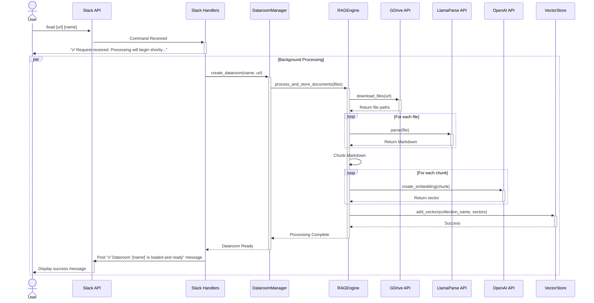
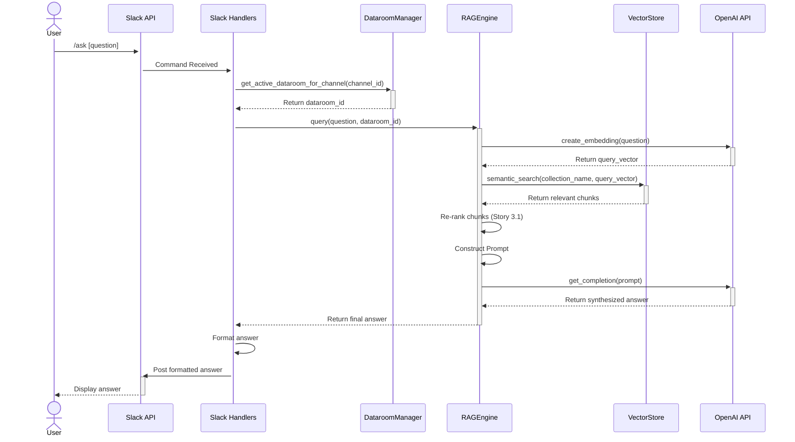

# DataRoom Intelligence Bot v2.0 Architecture Document

## 1. Introduction

This document outlines the overall project architecture for the **DataRoom Intelligence Bot v2.0**, including backend systems, data processing pipelines, and core service components. Its primary goal is to serve as the guiding architectural blueprint for development, ensuring consistency and adherence to the chosen patterns and technologies defined in the PRD.

### 1.1. Starter Template or Existing Project

This is a **greenfield implementation** of a new RAG architecture. However, it is not being built entirely from scratch.

*   **Existing Foundation:** The project will retain and build upon the existing Python application shell, which includes the **Flask** server for health checks and the **Slack Bolt** framework for command handling.
*   **New Core Logic:** All core data processing and analysis logic (the `doc_processor`, `ai_analyzer`, and new RAG components) will be completely rebuilt as specified in the PRD.

No other external starter templates will be used.

### 1.2. Change Log

| Date | Version | Description | Author |
| :--- | :--- | :--- | :--- |
| 2025-09-22 | 1.0 | Initial Architecture draft based on PRD v1.0. | Winston (Architect) |

---

## 2. High Level Architecture

### 2.1. Technical Summary

This architecture implements a professional **Retrieval-Augmented Generation (RAG)** pipeline within a Python-based monolithic application. The core of the system is a data processing engine that uses **LlamaParse** for layout-aware document parsing and **LlamaIndex** for orchestration, with **ChromaDB** serving as the vector store. This design directly addresses the primary goal of the PRD (G3) by creating a high-fidelity, structured data foundation to enable reliable, context-aware analysis by the **GPT-4o** model.

### 2.2. High Level Overview

*   **Architectural Style:** The system is designed as a **Monolith**. This is a pragmatic choice for the MVP, prioritizing development speed, ease of deployment, and simplified debugging over the complexities of a distributed system.
*   **Repository Structure:** A **Monorepo** will be used, containing all application code, handlers, and core logic in a single repository. This simplifies dependency management and ensures atomic commits across the system.
*   **Primary Data Flow:**
    1.  **Ingestion (`/load`):** Documents are downloaded from a source, parsed into structured Markdown by **LlamaParse**, segmented into layout-aware chunks, converted to embeddings, and stored in a persistent **ChromaDB** collection.
    2.  **Retrieval (`/ask`, `/summary`):** A user query is used to retrieve relevant chunks from the vector store. These chunks, along with the original query, are passed to the **GPT-4o** model for synthesis, and the final answer is returned to the user.

### 2.3. High Level Project Diagram

```mermaid
graph TD
    subgraph User Interface
        A[Slack Workspace]
    end

    subgraph Application Layer (Python Monolith)
        B[Slack Bolt Handlers]
        C[Dataroom Manager]
        D[RAG Engine]
        E[Core Services]
    end

    subgraph Data Layer
        F[ChromaDB (Vector Store)]
        G[JSON Index (Dataroom Metadata)]
    end

    subgraph External Services
        H[Google Drive API]
        I[LlamaParse API]
        J[OpenAI API]
    end

    A -- /load, /connect, /ask, etc. --> B;
    B -- Manages --> C;
    B -- Uses --> D;
    C -- Accesses --> G;
    D -- Uses --> E;
    D -- Accesses --> F;
    E -- Calls --> H;
    E -- Calls --> I;
    D -- Calls --> J;
```

### 2.4. Architectural and Design Patterns

*   **Repository Pattern:** This pattern will be used to abstract all data storage operations. Specifically, the `DataroomManager` will handle metadata storage (via a JSON file for the MVP), and a `VectorStore` service will abstract the interactions with ChromaDB.
    *   *Rationale:* This decouples our application logic from the specific database implementation, making it easier to swap out ChromaDB for Pinecone in the future or change how metadata is stored. It also simplifies testing.
*   **Service Layer:** The core logic will be organized into distinct services within the `core/` directory (e.g., `ParsingService`, `RAGEngine`). These services will be instantiated and used by the Slack command handlers.
    *   *Rationale:* This promotes a clean separation of concerns between the presentation layer (Slack handlers) and the business logic, improving modularity and testability.
*   **Asynchronous Task Execution:** The `/load` command, which is a long-running I/O-bound operation, will be executed in a background thread.
    *   *Rationale:* This fulfills requirement **NFR6** by preventing the application from appearing frozen and allowing the bot to provide progress updates to the user in Slack.

---

## 3. Tech Stack

### 3.1. Cloud Infrastructure

*   **Provider:** Railway.app (or similar PaaS)
    *   *Rationale:* For the MVP, a simple Platform-as-a-Service is ideal. It minimizes infrastructure overhead, allowing us to focus on application development. The presence of `railway.toml` in the repository suggests a pre-existing preference.
*   **Key Services:** App Hosting, Persistent Volumes (for ChromaDB).

### 3.2. Technology Stack Table

| Category | Technology | Version | Purpose | Rationale |
| :--- | :--- | :--- | :--- | :--- |
| **Language** | Python | ~3.11 | Primary development language | Mature, extensive data science ecosystem, required by core frameworks. |
| **Backend Framework** | Flask | ~2.3 | Web server for health checks | Lightweight, simple, and already integrated into the project. |
| **Slack Integration** | Slack Bolt for Python | ~1.18 | Core Slack app framework | The official and robust library for building Slack apps. |
| **PDF Parsing** | LlamaParse API | N/A (API) | PDF to Markdown conversion | Chosen for its optimal balance of quality, speed, and native Markdown output. |
| **RAG Framework** | LlamaIndex | ~0.9.0 | RAG orchestration | Purpose-built for RAG, with excellent support for our chosen components. |
| **Vector Database** | ChromaDB | ~0.4.0 | Vector storage for embeddings | Simple, local-first, and sufficient for MVP needs. Allows for future migration. |
| **Embeddings Model**| OpenAI API | `text-embedding-3-small` | Text-to-vector conversion | Best balance of performance and cost in the OpenAI model family. |
| **LLM** | OpenAI API | `gpt-4o` | Core model for synthesis/analysis | State-of-the-art reasoning, speed, and large context window. |
| **Data Validation** | Pydantic | ~2.0 | Data validation & settings | Modern, robust data validation to ensure type safety and reliability. |

---

## 4. Data Models

For our MVP, the data model is simple and focuses on two core entities: the `Dataroom` and the `ChannelConnection`.

### 4.1. Dataroom

This is the central entity in our system. It represents a single, processed collection of documents that has been loaded into the system via the `/load` command.

*   **Purpose:** To act as a persistent, reusable container for a complete set of analyzed documents and their corresponding vector embeddings.
*   **Key Attributes:**
    *   `dataroom_id` (string): A unique identifier for the dataroom (e.g., `dr_20250922_startup_x`).
    *   `name` (string): The user-friendly display name (e.g., "Startup X Series A").
    *   `created_at` (datetime): Timestamp of when the dataroom was created.
    *   `source_url` (string): The original Google Drive URL from which the documents were loaded.
    *   `vector_collection_name` (string): The name of the corresponding collection within ChromaDB where the document chunks are stored.
    *   `document_manifest` (list): A list of metadata objects for each document processed, including filename, page count, and chunk count.
*   **Relationships:** A `Dataroom` can be connected to one or more `ChannelConnection`s.

### 4.2. ChannelConnection

This is not a database model, but a simple mapping to track which Dataroom is active in which Slack channel. For the MVP, this will be managed by the `DataroomManager` and can be persisted in a simple JSON file.

*   **Purpose:** To link a specific Slack channel to a specific `Dataroom`, providing the context for commands like `/ask` and `/summary`.
*   **Key Attributes:**
    *   `channel_id` (string): The unique ID of the Slack channel (e.g., `C09E2JQ6YET`).
    *   `dataroom_id` (string): The ID of the `Dataroom` currently connected to this channel.

---

## 5. Components

The application will be organized into the following logical components, primarily separated into a `handlers` layer for Slack interactions and a `core` layer for business logic.

### 5.1. Slack Command Handlers

*   **Responsibility:** This layer is the entry point for all user interactions. Its sole responsibility is to parse incoming Slack commands, validate inputs, call the appropriate core services, and format the results for posting back to Slack. It contains no business logic.
*   **Key Interfaces:** `handle_load()`, `handle_connect()`, `handle_ask()`, `handle_summary()`, etc.
*   **Dependencies:** `DataroomManager`, `RAGEngine`.
*   **Location:** `handlers/`

### 5.2. DataroomManager

*   **Responsibility:** To be the central service for managing the lifecycle of Dataroom entities and their connections to Slack channels. It handles the creation, persistence, and retrieval of all Dataroom metadata.
*   **Key Interfaces:** `create_dataroom()`, `get_dataroom_by_name()`, `list_all_datarooms()`, `connect_channel_to_dataroom()`, `get_active_dataroom_for_channel()`.
*   **Dependencies:** `RAGEngine` (to trigger processing), `VectorStore` (to manage collections).
*   **Location:** `core/dataroom_manager.py`

### 5.3. ParsingService

*   **Responsibility:** To abstract all interactions with the external document parsing API (LlamaParse). This component's job is to take a file path and return structured Markdown.
*   **Key Interfaces:** `parse_document(file_path)`.
*   **Dependencies:** LlamaParse API Client.
*   **Location:** `core/parser.py`

### 5.4. RAGEngine

*   **Responsibility:** To orchestrate the entire RAG pipeline for a given set of documents. This includes chunking the parsed Markdown, generating embeddings, storing them in the vector store, and handling the retrieval/synthesis process for answering questions.
*   **Key Interfaces:** `process_and_store_documents()`, `query()`, `get_summary()`.
*   **Dependencies:** `ParsingService`, `VectorStore`, OpenAI API Client.
*   **Location:** `core/rag_engine.py`

### 5.5. VectorStore

*   **Responsibility:** To provide a simple, abstract interface for interacting with the vector database (ChromaDB). This isolates the rest of the application from the specific implementation details of the DB.
*   **Key Interfaces:** `create_collection()`, `add_nodes()`, `semantic_search()`.
*   **Dependencies:** ChromaDB Client.
*   **Location:** `core/vector_store.py`

---

## 6. External APIs

This project relies on three primary external services for its core functionality, plus the Google Drive API for document retrieval.

### 6.1. LlamaParse API

*   **Purpose:** To parse source documents (especially PDFs) into high-quality, structured Markdown, preserving layout elements like tables. This is the cornerstone of our data ingestion pipeline.
*   **Documentation:** [LlamaParse API Reference](https://cloud.llamaindex.ai/parse)
*   **Authentication:** API Key provided via the `LLAMA_CLOUD_API_KEY` environment variable.
*   **Rate Limits:** Subject to the user's LlamaCloud plan. The implementation must handle potential rate limit errors gracefully.
*   **Key Endpoints Used:** The `llama-parse` library abstracts the direct endpoint, which is effectively `POST /api/v1/parse`.

### 6.2. OpenAI API

This API is used for two distinct purposes: generating embeddings and synthesizing text.

*   **Purpose:**
    1.  **Embeddings:** To convert the structured text chunks into vector representations for semantic search.
    2.  **Chat Completions:** To generate narrative summaries and answers based on the user's query and the retrieved context.
*   **Documentation:** [OpenAI API Reference](https://platform.openai.com/docs/api-reference)
*   **Authentication:** API Key provided via the `OPENAI_API_KEY` environment variable.
*   **Rate Limits:** Depends on the user's OpenAI account tier. The application must implement retry logic (as per NFR5).
*   **Key Endpoints Used:**
    *   `POST /v1/embeddings` (using model `text-embedding-3-small`)
    *   `POST /v1/chat/completions` (using model `gpt-4o`)

### 6.3. Google Drive API

*   **Purpose:** To list and download source documents from the Google Drive folder URL provided by the user in the `/load` command.
*   **Documentation:** [Google Drive API Reference](https://developers.google.com/drive/api/v3/reference)
*   **Authentication:** Service Account JSON credentials provided via the `GOOGLE_SERVICE_ACCOUNT_JSON` environment variable.
*   **Rate Limits:** Standard Google API usage limits apply.
*   **Key Endpoints Used:**
    *   `files.list`
    *   `files.get` (with `alt=media` for download)

---

## 7. Core Workflows

### 7.1. Workflow 1: Data Ingestion via `/load` Command

This diagram illustrates the asynchronous process of loading and processing a new dataroom.



### 7.2. Workflow 2: Q&A via `/ask` Command

This diagram illustrates the synchronous process of answering a user's question.



---

## 8. Database Schema

### 8.1. Metadata Storage: JSON Files

For the MVP, all non-vector metadata will be stored in simple JSON files on the local filesystem. This approach is simple, human-readable, and sufficient for our single-tenant architecture, avoiding the need for a traditional relational database.

**`datarooms.json`**
*   **Purpose:** Acts as the primary index for all persistent Datarooms.
*   **Structure:** A dictionary where the key is the `dataroom_id` and the value is an object containing its metadata.

    ```json
    {
      "dr_20250922_startup_x": {
        "name": "Startup X Series A",
        "created_at": "2025-09-22T18:00:00Z",
        "source_url": "https://drive.google.com/...",
        "vector_collection_name": "collection_startup_x_123",
        "document_manifest": [
          { "name": "pitch_deck.pdf", "chunks": 192 },
          { "name": "financials.xlsx", "chunks": 45 }
        ]
      }
    }
    ```

**`connections.json`**
*   **Purpose:** Maps an active Slack channel to a Dataroom.
*   **Structure:** A simple dictionary where the key is the `channel_id` and the value is the `dataroom_id`.

    ```json
    {
      "C09E2JQ6YET": "dr_20250922_startup_x"
    }
    ```

### 8.2. Vector Store Schema (ChromaDB)

ChromaDB is a document-oriented vector database. We will not define a rigid schema, but rather a consistent structure for the **metadata** associated with each vector/chunk. This metadata is critical for source attribution and advanced retrieval strategies.

*   **Collection Name:** Each Dataroom will have its own collection in ChromaDB, named using its `vector_collection_name` (e.g., `collection_startup_x_123`).
*   **Document Content:** The text content of each chunk.
*   **Document Metadata Schema:** Each vector will have the following metadata attached:

    ```json
    {
      "source_document_name": "pitch_deck.pdf",
      "chunk_type": "table", // or "paragraph", "list_item", etc.
      "page_number": 5, // If applicable
      "parent_chunk_id": "parent_chunk_abc" // For Parent Document Retrieval
    }
    ```
*   **Rationale:** This metadata structure allows us to filter queries (e.g., "search only in tables") and to reliably trace any piece of retrieved context back to its exact source document and location, fulfilling requirement **NFR2**.

---

## 9. Source Tree

The project will follow a clean, modular structure designed to separate the Slack-facing handlers from the core business logic.

```
dataroom-intelligence/
├── .env.example              # Environment variable template
├── .gitignore
├── app.py                    # Main Flask/Slack application entry point
├── Procfile                  # For deployment (e.g., Railway, Heroku)
├── requirements.txt          # Python dependencies
│
├── core/                     # Core business logic and services (The "Engine")
│   ├── __init__.py
│   ├── dataroom_manager.py   # Manages Dataroom entities and connections
│   ├── parser.py             # Handles LlamaParse API integration
│   ├── rag_engine.py         # Orchestrates the RAG pipeline (chunk, embed, retrieve, synth)
│   └── vector_store.py       # Abstraction for ChromaDB
│
├── data/                     # Local data persistence for MVP
│   ├── datarooms.json        # Metadata index for all Dataroom entities
│   ├── connections.json      # Maps Slack channels to Dataroom IDs
│   └── vector_storage/       # Directory for ChromaDB's on-disk persistence
│
├── handlers/                 # Slack command handlers (The "Presentation Layer")
│   ├── __init__.py
│   ├── admin_handlers.py     # Handles /list, /current, /disconnect, /help
│   ├── ask_handler.py        # Handles the /ask command
│   ├── connect_handler.py    # Handles the /connect command
│   ├── load_handler.py       # Handles the /load command
│   └── summary_handler.py    # Handles the /summary command
│
├── models/                   # Pydantic data models
│   ├── __init__.py
│   └── dataroom.py           # Defines the Dataroom and Document models
│
├── prompts/                  # Centralized storage for all LLM prompts
│   ├── __init__.py
│   ├── analysis_prompts.py   # Prompts for /summary
│   └── qa_prompts.py         # Prompts for /ask
│
├── docs/                     # Project documentation
│   ├── prd.md                # The Product Requirements Document
│   └── architecture.md       # This document
│
└── tests/                    # Unit and Integration tests
    ├── __init__.py
    ├── test_core_logic.py
    └── test_handlers.py
```

---

## 10. Infrastructure and Deployment

### 10.1. Infrastructure as Code

*   **Tool:** Railway Native Configuration (`railway.toml`)
*   **Location:** Root of the repository.
*   **Approach:** We will use Railway's built-in "Infrastructure as Code" capabilities to define our services and build/start commands.

### 10.2. Deployment Strategy

*   **Strategy:** Continuous Deployment.
*   **CI/CD Platform:** GitHub Actions.
*   **Trigger:** Every merge to the `main` branch will automatically trigger the CI/CD pipeline to run tests and deploy to production.

### 10.3. Environments

*   **`development`:** The local machines of our developers.
*   **`production`:** The live environment hosted on Railway.

### 10.4. Environment Promotion Flow

The promotion flow is simple and automated:
`Local Development` -> `Git Push to main` -> `GitHub Actions (Run Tests)` -> `Deploy to Production on Railway`

### 10.5. Rollback Strategy

*   **Primary Method:** Manual one-click rollback via the Railway platform UI.
*   **Rationale:** Railway maintains a history of all deployments, allowing for instant rollback to a previous stable version in case of a critical issue.

### 10.6. Local Development Workflow

*   **Problem:** Slack requires a public URL to send events, but a developer's local server is not public.
*   **Solution:** We will use a tunneling service (`ngrok`) and a dedicated "Development" Slack App to allow developers to test their local code live without affecting the production application.
*   **Workflow:**
    1.  A separate "Development" Slack App with its own API tokens will be used.
    2.  The developer runs the application locally, using the development tokens.
    3.  The developer starts `ngrok` to create a secure, public URL that tunnels to their local server.
    4.  The developer temporarily sets their `ngrok` URL as the "Request URL" in the Development Slack App's configuration.
    5.  This provides perfect isolation, allowing for safe and rapid testing in a private channel or test workspace.

---

## 11. Error Handling Strategy

### 11.1. General Approach

*   **Error Model:** The application will use standard Python exceptions. We will define a hierarchy of custom exceptions (e.g., `DataroomNotFoundError`, `ParsingError`) that inherit from a base `AppException`.
*   **Error Propagation:** The `core` service layer will be responsible for raising specific exceptions. The `handlers` layer will be responsible for catching all exceptions, logging the full technical details, and sending a user-friendly, formatted error message to Slack. Under no circumstances should a raw stack trace be shown to the end-user.

### 11.2. Logging Standards

*   **Library:** Python's built-in `logging` module.
*   **Format:** Structured JSON. This allows for easy parsing and filtering in a production logging system.
*   **Required Context:** To enable effective debugging, every log entry generated during a user request must include a unique `trace_id` and the `channel_id` from the Slack event.

### 11.3. Error Handling Patterns

*   **External API Errors:**
    *   **Retry Policy:** For transient network errors or temporary service unavailability (e.g., 503 errors from LlamaParse), the application will use a retry mechanism with exponential backoff (as per **NFR5**).
    *   **Fail-Fast:** For permanent errors (e.g., 401 Invalid API Key, 404 Not Found), the application will fail immediately and log a critical error.
*   **Business Logic Errors:**
    *   Custom exceptions will be used to represent known error states (e.g., user tries to `/connect` to a non-existent dataroom).
    *   The handler will catch these specific exceptions and provide a helpful, context-aware message to the user (e.g., "Error: Dataroom 'xyz' not found. Use `/list` to see available datarooms.").

---

## 12. Coding Standards

These standards are mandatory for all code committed to the repository.

### 12.1. Core Standards

*   **Language:** Python 3.11+
*   **Style & Linting:** The project will use **Black** for uncompromising code formatting and **Ruff** for linting. A pre-commit hook should be configured to automatically format and lint code before every commit.
*   **Test Organization:** Test files must be located in the `tests/` directory and follow the `test_*.py` naming convention.

### 12.2. Naming Conventions

*   Standard **PEP 8** will be followed: `snake_case` for functions, methods, and variables; `PascalCase` for classes.

### 12.3. Critical Rules

1.  **Type Hinting is Mandatory:** All function and method signatures, including arguments and return values, MUST use Python's standard type hints.
    *   *Rationale:* This is critical for static analysis, code completion, and ensuring data flows correctly between components. It is the single most important rule for preventing bugs in a project of this nature.
2.  **Strict Separation of Concerns:** Logic must be delegated to the appropriate layer. Handlers in the `handlers/` directory should contain no business logic; their role is to parse requests and call services in the `core/` directory.
    *   *Rationale:* This enforces our component-based architecture, making the system modular and testable.
3.  **No Hardcoded Secrets:** API keys, tokens, and other secrets MUST NOT be written in the source code. They must be loaded exclusively from environment variables via the configuration system.
    *   *Rationale:* This is a fundamental security requirement.
4.  **Use the Structured Logger:** All diagnostic output must use the configured structured logger. `print()` statements are forbidden in committed code.
    *   *Rationale:* This ensures our logs are consistent, machine-readable, and useful for debugging in production.

---

## 13. Test Strategy and Standards

### 13.1. Testing Philosophy

*   **Approach:** Test-After. For the speed required by the MVP, tests will be written immediately after the functionality of a component is implemented and manually verified.
*   **Coverage Goals:** We will aim for **>80% line coverage** for all modules in the `core/` directory. The `handlers/` layer will be tested primarily via integration tests.
*   **Test Pyramid:** Our focus will be on a wide base of fast **Unit Tests**, a smaller set of **Integration Tests** for the core data pipeline, and a final manual **End-to-End Validation** as defined in Epic 4.

### 13.2. Test Types and Organization

#### Unit Tests
*   **Framework:** `pytest`
*   **File Convention:** `tests/test_*.py`
*   **Location:** The `tests/` directory.
*   **Mocking Library:** Python's built-in `unittest.mock`.
*   **AI Agent Requirements:**
    *   The developer agent MUST generate unit tests for all public methods in the `core/` services.
    *   All external dependencies (especially API calls to LlamaParse and OpenAI) MUST be mocked.
    *   Tests should follow the "Arrange, Act, Assert" (AAA) pattern.

#### Integration Tests
*   **Scope:** The primary integration test will validate the entire data ingestion pipeline triggered by the `/load` command, from parsing to storage.
*   **Location:** `tests/integration/`
*   **Test Infrastructure:**
    *   **External APIs:** All external APIs (LlamaParse, OpenAI) will be mocked using `unittest.mock` to ensure tests are fast and do not incur costs.
    *   **Vector Database:** Tests will run against a real, temporary ChromaDB instance on disk to verify the storage and retrieval mechanism.

### 13.3. Test Data Management

*   **Strategy:** A dedicated `tests/fixtures/` directory will be created to hold all test data.
*   **Fixtures:** This directory will contain small, representative sample documents (e.g., a 1-page PDF with a table, a sample `.txt` file) and "golden files" with the expected Markdown output after parsing.

---

## 14. Security

### 14.1. Input Validation

*   **Validation Library:** `Pydantic` will be used for all data validation.
*   **Validation Location:** All incoming data from Slack commands MUST be validated in the `handlers` layer before being passed to any `core` service. We will operate on a "zero trust" basis for all external input.

### 14.2. Authentication & Authorization

*   **Authentication:** All communication with external APIs (LlamaParse, OpenAI, Google Drive) will be authenticated using API Keys or Service Accounts as defined in the "External APIs" section. Communication with Slack is secured via Slack's token-based system.
*   **Authorization:** For the MVP, the authorization model is simple. Any user who is a member of a Slack channel where the bot is present is authorized to use all of its commands. There are no per-user roles or permissions.

### 14.3. Secrets Management

*   **Development:** Secrets will be managed using local `.env` files, which MUST NOT be committed to version control.
*   **Production:** Secrets will be managed exclusively through the environment variable system provided by our deployment platform (Railway).
*   **Critical Rule:** Secrets (API keys, tokens) MUST NEVER be hardcoded in the source code.

### 14.4. Data Protection

*   **Encryption in Transit:** All communication with external APIs and with the Slack API MUST use HTTPS.
*   **Encryption at Rest:** We will rely on the default filesystem encryption provided by the production deployment platform (Railway) for our persisted data (JSON files, ChromaDB data).
*   **PII Handling:** While we are not explicitly processing PII, all documents loaded into the system must be treated as confidential. The single-tenant architecture is our primary control to ensure data isolation and confidentiality.

### 14.5. Dependency Security

*   **Scanning Tool:** We will use **GitHub's Dependabot** to automatically scan our `requirements.txt` file for known vulnerabilities and recommend updates.
