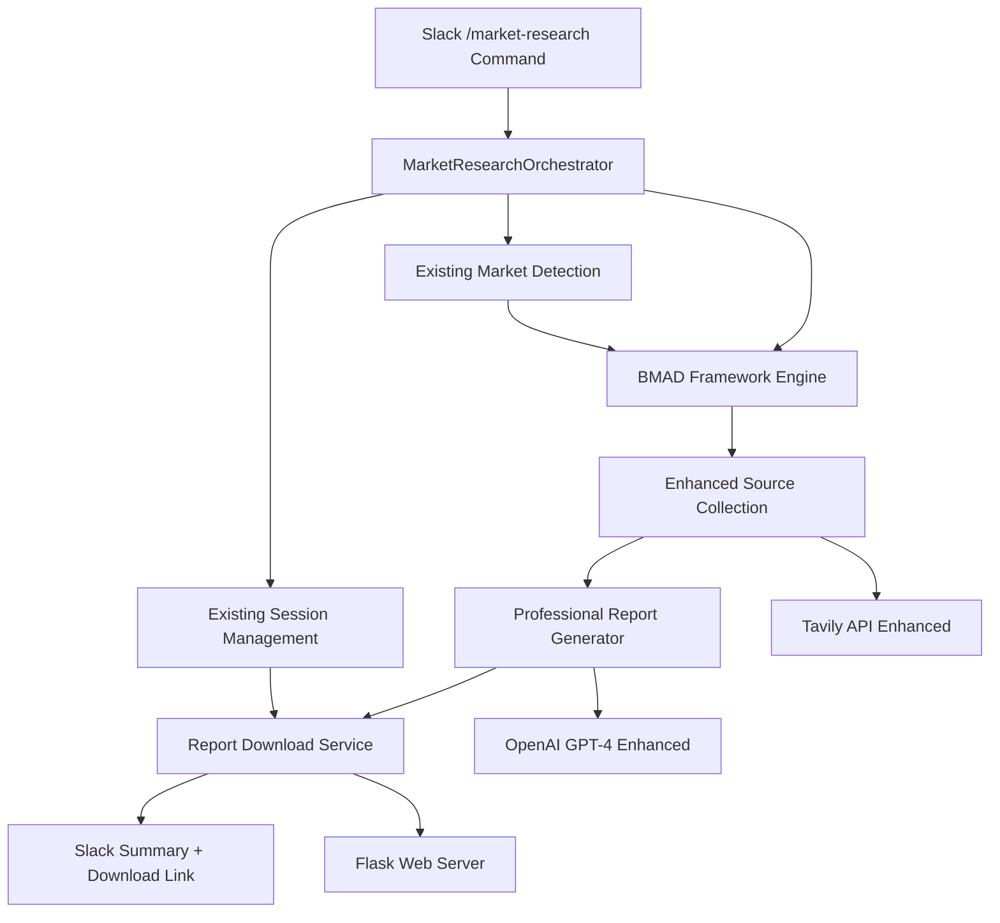

# DataRoom Intelligence Phase 3 Brownfield Enhancement Architecture

## Introduction

This document outlines the architectural approach for enhancing DataRoom Intelligence with **Professional Market Intelligence System (Phase 3)**. Its primary goal is to serve as the guiding architectural blueprint for AI-driven development of McKinsey/BCG quality market research capabilities while ensuring seamless integration with the existing Flask + Slack Bolt system.

**Relationship to Existing Architecture:**
This document supplements the existing brownfield architecture by defining how new BMAD Framework components will integrate with current systems. The architecture addresses the critical quality failure of the current `/market-research` command through **strategic incremental enhancement** rather than complete system replacement.

**Development Approach:**
- **Local Development and Testing**: All Phase 3 development occurs locally with thorough quality validation
- **Production Stability**: Existing Railway deployment remains unchanged until proven replacement is ready
- **Incremental Implementation**: Phased rollout minimizes risk while building toward McKinsey quality standards
- **Quality-First Deployment**: New system only replaces production when quality exceeds current baseline

### Change Log

| Date       | Version | Description                           | Author    |
| ---------- | ------- | ------------------------------------- | --------- |
| 2025-01-09 | 1.0     | Phase 3 architecture design complete | Winston   |

## Existing Project Analysis

Based on comprehensive project analysis, the current DataRoom Intelligence system state:

**Current Project State:**
- **Primary Purpose:** AI-powered data room analysis for VC investment decisions with market intelligence capabilities
- **Current Tech Stack:** Python 3.11+, Flask 2.3.3, Slack Bolt 1.18.0, OpenAI API, Tavily Search, Railway deployment
- **Architecture Style:** Agent-based processing with Flask web server and Slack integration
- **Deployment Method:** Railway cloud platform with automatic deployment from main branch

**Available Documentation:**
- Comprehensive PRD for Phase 3 enhancement (`docs/prd.md`)
- Project Brief with business requirements (`docs/Project-Brief-Deep-market-research.md`)
- Brownfield architecture analysis (`docs/brownfield-architecture.md`)
- CLAUDE.md with development patterns and current system status

**Identified Constraints:**
- In-memory session management (`user_sessions` dict) - sessions lost on restart
- **ARCHITECTURAL DEFECT**: Current session key (`user_id` only) causes data loss when users analyze multiple startups across different channels (POST-DEMO PRIORITY)
- Railway deployment resource limits (unknown - requires investigation)
- Current market research quality failure requiring complete reconstruction of synthesis logic
- Production-only testing approach for Phase 3 (`TEST_MODE=false`)

## Enhancement Scope and Integration Strategy

**Enhancement Overview:**
- **Enhancement Type:** Professional Market Intelligence System Reconstruction (Demo-Focused)
- **Scope:** Complete replacement of `/market-research` command synthesis logic to achieve McKinsey/BCG quality standards with 50+ source processing and 10-20 page professional report generation
- **Integration Impact:** Moderate - Enhanced market research capabilities with preserved document analysis workflows

**Integration Approach:**
- **Code Integration Strategy:** Incremental enhancement of existing `agents/market_research_orchestrator.py` and `utils/expert_formatter.py` while preserving Flask + Slack Bolt architecture
- **Database Integration:** Maintain current in-memory `user_sessions` dict structure, add permanent report storage for demo purposes
- **API Integration:** Expand Tavily API usage (24→50+ sources), enhance OpenAI GPT-4 integration with BMAD Framework prompting
- **UI Integration:** Enhanced Slack summarization with links to full professional reports, preserve existing command structure

**Compatibility Requirements:**
- **Existing API Compatibility:** All current Slack commands (`/analyze`, `/ask`, `/reset`, `/health`) remain fully functional
- **Database Schema Compatibility:** No breaking changes to session management structure (defer multi-channel fixes to post-demo)
- **UI/UX Consistency:** Enhanced `/market-research` output maintains Slack threading patterns, adds professional report delivery
- **Performance Impact:** Acceptable processing time increase (2-3 minutes) for professional quality output, monitor Railway resource usage

## Tech Stack Alignment

**Existing Technology Stack**

| Category | Current Technology | Version | Usage in Enhancement | Notes |
|----------|-------------------|---------|---------------------|--------|
| Runtime | Python | 3.11+ | Core platform for BMAD Framework | Maintain current version |
| Web Framework | Flask | 2.3.3 | Preserved for Railway health checks | No changes required |
| Slack Integration | slack-bolt | 1.18.0 | Enhanced command handling | Maintain existing patterns |
| AI Processing | openai | >=1.6.1 | Enhanced GPT-4 integration for BMAD | Critical for professional synthesis |
| Web Search | tavily-python | 0.7.11 | Expanded from 24 to 50+ sources | May need rate limiting enhancements |
| Cloud Platform | Railway | Current | Demo deployment platform | Resource monitoring required |
| Document Processing | PyPDF2, python-docx, openpyxl | Current | Preserved for `/analyze` command | No changes needed |
| Google Integration | google-api-python-client | 2.108.0 | Maintained for data room access | Existing functionality preserved |

**New Technology Additions:** None required - All Phase 3 requirements achievable with existing stack.

## Data Models and Schema Changes

**Professional Report Storage (Permanent Download Architecture):**
```python
user_sessions[user_id] = {
    # Existing session data from /analyze
    "analysis_result": existing_analysis,
    "processed_documents": processed_documents, 
    "market_profile": market_profile,
    
    # Professional report - permanent asset
    "professional_report": {
        "file_name": "market_research_report_StartupX_2025-01-09.md",
        "permanent_file_path": "/app/reports/user_123_startup_x_20250109.md",
        "permanent_download_link": "http://app-url/download/user_123_startup_x_20250109",
        "generation_timestamp": "2025-01-09T14:30:00Z",
        "slack_summary": "3500-char professional summary",
        "metadata": {
            "confidence_score": 85.5,
            "source_count": 52,
            "quality_score": 78.2,
            "pages": 15
        }
    }
}
```

**BMAD Analysis Context Model:**
```python
bmad_context = {
    "research_type": "competitive_intelligence",  # 1 of 8 BMAD research types
    "expert_persona": "senior_market_analyst",   # Specialized AI analyst persona
    "source_quality_scores": {                   # Quality assessment per source
        "source_1": 0.85,
        "source_2": 0.92
    },
    "synthesis_methodology": "bmad_framework_v1"
}
```

**Schema Integration Strategy:**
- **Database Changes Required:** None - enhanced session structure with permanent file references
- **File Storage:** Permanent app directory storage (`/reports`), no cleanup logic
- **Download Management:** Simple HTTP endpoint serving permanent report files
- **User Experience:** Professional asset with permanent access, user controls final organization

## Component Architecture

**New Components**

### BMAD Framework Integration Engine
- **Responsibility:** Implement BMAD methodology for structured intelligence processing with 8 research types and expert persona system
- **Integration Points:** Enhances existing `MarketResearchOrchestrator.perform_market_intelligence()` method
- **Key Interfaces:**
  - `bmad_research_selector(market_profile, startup_context)` → Select appropriate research methodology
  - `expert_persona_analyzer(research_type, source_data)` → Apply specialized analysis perspective
- **Dependencies:**
  - **Existing Components:** Current `market_detection.py` for market profile data
  - **New Components:** Enhanced source processing engine for 50+ sources
- **Technology Stack:** Pure Python integration with existing OpenAI API calls

### Professional Report Generator  
- **Responsibility:** Generate 10-20 page McKinsey-quality markdown reports from BMAD analysis with proper formatting and structure
- **Integration Points:** Replaces current synthesis logic in `utils/expert_formatter.py`
- **Key Interfaces:**
  - `generate_professional_report(bmad_analysis, source_data)` → Full 10-20 page report
  - `create_executive_summary(full_report)` → 3500-char Slack summary
  - `validate_report_quality(report_content)` → Quality score verification
- **Dependencies:**
  - **Existing Components:** Current OpenAI integration for synthesis
  - **New Components:** BMAD Framework Engine for structured analysis data
- **Technology Stack:** Enhanced GPT-4 prompting with professional report templates

### Enhanced Source Collection Engine
- **Responsibility:** Expand source collection from 24 to 50+ high-quality sources with intelligent quality filtering
- **Integration Points:** Enhances existing Tavily API integration in `utils/web_search.py`
- **Key Interfaces:**  
  - `collect_comprehensive_sources(market_profile, query_set)` → 50+ validated sources
  - `quality_filter_sources(raw_sources)` → High-credibility source selection
  - `rate_limit_manager()` → API usage optimization with backoff strategies
- **Dependencies:**
  - **Existing Components:** Current Tavily integration and market detection
  - **New Components:** BMAD Framework for intelligent query generation
- **Technology Stack:** Enhanced Tavily API usage with rate limiting and quality scoring

### Report Download Service
- **Responsibility:** Manage permanent report file storage and download delivery for professional assets
- **Integration Points:** New Flask endpoint integrated with existing web server
- **Key Interfaces:**
  - `store_permanent_report(report_content, user_id, startup_id)` → Permanent file path
  - `generate_download_link(report_file_path)` → Permanent access URL  
  - `serve_report_download(download_token)` → File delivery to user
- **Dependencies:**
  - **Existing Components:** Flask web server and session management
  - **New Components:** Professional Report Generator for content
- **Technology Stack:** Flask file serving with permanent storage in app directory

### Component Interaction Diagram



## Source Tree Integration

**New File Organization**
```plaintext
dataroom-intelligence/
├── app.py                           # Enhanced with download endpoint
├── agents/                          
│   ├── market_research_orchestrator.py  # BMAD Framework integration
│   ├── bmad_framework/              # NEW: BMAD methodology modules
│   │   ├── __init__.py
│   │   ├── research_selector.py    # 8 research type selection
│   │   ├── expert_personas.py      # Specialized analysis perspectives  
│   │   └── methodology_engine.py   # Core BMAD processing logic
│   ├── market_detection.py         # Existing - preserved
│   └── base_agent.py               # Existing - preserved
├── handlers/                        
│   ├── market_research_handler.py  # Enhanced Slack integration
│   ├── report_download_handler.py  # NEW: Download service
│   └── ai_analyzer.py              # Existing - preserved
├── utils/
│   ├── expert_formatter.py         # MAJOR OVERHAUL: Professional report generation
│   ├── professional_reports/        # NEW: Report generation modules
│   │   ├── __init__.py
│   │   ├── report_templates.py     # McKinsey-style templates
│   │   ├── quality_validator.py    # Quality scoring and validation
│   │   └── summary_generator.py    # Slack-optimized summaries
│   ├── web_search.py               # Enhanced source collection (50+)
│   └── slack_formatter.py          # Enhanced with download links
├── reports/                         # NEW: Permanent report storage
│   └── .gitkeep                    # Directory structure preservation
├── config/
│   └── settings.py                 # Minor additions for report paths
├── docs/
│   ├── prd.md                      # Phase 3 requirements
│   ├── architecture.md             # This document
│   └── brownfield-architecture.md  # Current system analysis
└── requirements.txt                # NO CHANGES - existing stack sufficient
```

**Integration Guidelines:**
- **File Naming:** Maintain existing snake_case convention for all new modules
- **Folder Organization:** New functionality organized in logical submodules (bmad_framework/, professional_reports/)  
- **Import/Export Patterns:** Follow existing relative import patterns, maintain backward compatibility for existing imports

## Infrastructure and Deployment Integration

**Existing Infrastructure:**
- **Current Deployment:** Railway cloud platform with automatic deployment from main branch
- **Infrastructure Tools:** Railway native deployment, environment variable configuration, health check endpoints
- **Environments:** Single production environment with Railway auto-scaling

**Enhancement Deployment Strategy:**
- **Deployment Approach:** Incremental enhancement deployment using existing Railway pipeline with no infrastructure changes required
- **Infrastructure Changes:** 
  - Add `/reports` directory for permanent file storage
  - Monitor memory usage for 50+ source processing
  - Potential need for Railway plan upgrade if resource limits exceeded
- **Pipeline Integration:** No changes to existing deployment pipeline - pure code enhancements

**Railway Resource Considerations:**
- **Memory Impact:** Processing 50+ sources + generating 10-20 page reports significantly higher than current 24-source processing
- **Storage Requirements:** Permanent report storage in `/reports` directory
- **API Usage:** Increased OpenAI and Tavily API calls for professional quality output

**Rollback Strategy:**
- **Rollback Method:** Git revert to previous commit using Railway's automatic redeployment
- **Risk Mitigation:** Demo-first approach with local validation before production deployment
- **Monitoring:** Enhanced logging for memory usage, API rate limits, and processing times during Phase 3 operations

## Coding Standards and Conventions

**Existing Standards Compliance:**
- **Code Style:** Python PEP 8 standards with existing project conventions (snake_case functions/variables, CamelCase classes)
- **Linting Rules:** Current project uses standard Python linting without specific linter configuration files
- **Testing Patterns:** Production-only testing approach (`TEST_MODE=false`) for Phase 3 development, no unit test framework currently implemented
- **Documentation Style:** Comprehensive docstrings for public methods, inline comments for complex logic, architectural documentation in `/docs`

**Enhancement-Specific Standards:**
- **BMAD Framework Integration:** All BMAD methodology classes use descriptive naming (e.g., `ExpertPersonaAnalyzer`, `ResearchMethodologySelector`)
- **Professional Report Standards:** Generated reports must meet McKinsey formatting standards with proper section headers, bullet points, and executive summary structure
- **Quality Validation:** All synthesis functions include quality scoring with minimum 70% threshold validation
- **API Integration Standards:** Enhanced API calls include exponential backoff and rate limiting for 50+ source processing

**Critical Integration Rules:**
- **Existing API Compatibility:** All existing Slack commands (`/analyze`, `/ask`, `/reset`, `/health`) must continue functioning without modification
- **Database Integration:** Enhanced session structure maintains backward compatibility with existing `user_sessions[user_id]` dictionary pattern
- **Error Handling:** Professional report generation includes graceful degradation to current output quality if BMAD processing fails
- **Logging Consistency:** All new components use existing `utils/logger.py` with consistent log levels and formatting

## Testing Strategy

**Integration with Existing Tests:**
- **Existing Test Framework:** None - current system uses production-only testing approach
- **Test Organization:** Phase 3 continues production-only testing with `TEST_MODE=false` for real-world validation
- **Coverage Requirements:** Manual validation of professional output quality against McKinsey standards

**New Testing Requirements:**

### Unit Tests for New Components
- **Framework:** None implemented for demo - focus on manual quality validation
- **Location:** Future implementation in `/tests` directory post-demo
- **Coverage Target:** Professional output quality validation (70% minimum quality score)
- **Integration with Existing:** Maintains current production-testing approach

### Integration Tests
- **Scope:** End-to-end `/market-research` command testing with real startup data and 50+ source processing
- **Existing System Verification:** All existing Slack commands continue functioning during Phase 3 testing
- **New Feature Testing:** Manual validation of McKinsey-quality report generation and download functionality

### Regression Testing
- **Existing Feature Verification:** Regular testing of `/analyze` command to ensure no degradation during Phase 3 development
- **Automated Regression Suite:** None - manual testing approach maintained for demo timeline
- **Manual Testing Requirements:** Demo scenario testing with real startup analysis and client presentation simulation

## Security Integration

**Existing Security Measures:**
- **Authentication:** Slack Bot token authentication for command access
- **Authorization:** User-based session isolation through Slack user IDs
- **Data Protection:** Temporary file storage with automatic cleanup
- **Security Tools:** Environment variable configuration for sensitive API keys

**Enhancement Security Requirements:**
- **New Security Measures:** Permanent report file access control through download tokens
- **Integration Points:** Report download service includes user validation before file serving
- **Compliance Requirements:** Professional reports stored securely in app directory with controlled access

**Security Testing:**
- **Existing Security Tests:** None - manual security validation
- **New Security Test Requirements:** Download token validation and file access control testing
- **Penetration Testing:** None required for demo - focus on functional security measures

## Next Steps

### Story Manager Handoff

*For Story Manager/Product Owner Agent:*

"Please proceed with Phase 3 Professional Market Intelligence implementation using this architecture document as reference. Key requirements validated with user:

- **Demo-First Priority**: Focus on McKinsey-quality report generation over architectural perfection
- **Incremental Enhancement**: Enhance existing components rather than complete replacement  
- **Permanent Report Downloads**: Users download `.md` reports manually for organization
- **Existing System Preservation**: All current commands must remain functional
- **Session Management**: Accept current limitations for demo, address multi-channel support post-demo
- **3-Week Timeline**: Aggressive schedule requiring focused execution on core quality improvements

First story should implement BMAD Framework integration in `agents/market_research_orchestrator.py` with clear checkpoints to validate existing system integrity."

### Developer Handoff

*For Development Team:*

"Begin Phase 3 implementation with this validated architecture foundation:

- **Architecture Reference**: This document reflects actual project analysis and user-validated requirements
- **Integration Requirements**: Enhance existing Flask + Slack Bolt architecture, preserve all current functionality  
- **Technical Priorities**: 
  1. BMAD Framework integration for structured intelligence processing
  2. Professional report generation (10-20 pages McKinsey quality)
  3. Enhanced source collection (24→50+ sources)
  4. Permanent report download system
- **Compatibility Requirements**: Existing session management must continue working, defer multi-channel fixes
- **Implementation Sequence**: Start with BMAD Framework integration, then professional report generation, finally download service
- **Quality Gates**: All output must meet 70% professional quality threshold before user delivery"

---

*This architecture document serves as the definitive blueprint for Phase 3 Professional Market Intelligence Enhancement, validated through comprehensive user interaction and existing system analysis.*