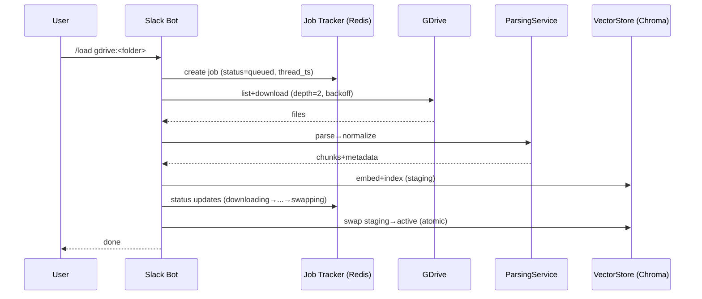
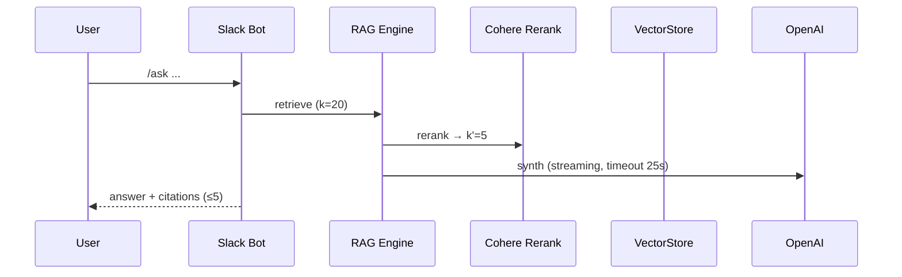
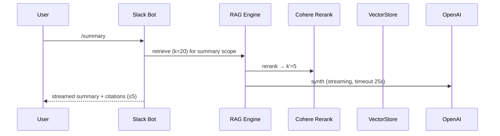
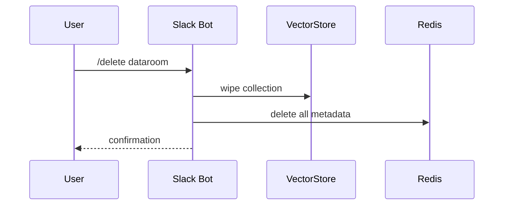

# DataRoom Intelligence Bot v2.0 Architecture Document (v1.4)

## 1. Introduction

This document outlines the implementation-ready architecture for the **DataRoom Intelligence Bot v2.0**. It is fully aligned with **PRD v1.1** and serves as the definitive technical blueprint for development.

### 1.1. Technical Changelog (v1.3 → v1.4)

*   **Workflows:** Added `/summary` sequence diagram.
*   **Citations:** Specified citation format for tabular data (Excel/CSV).
*   **Data Management:** Detailed the `/export` admin command.
*   **Observability:** Defined specific alert thresholds for latency SLOs.
*   **Decisions:** Finalized recommendations for open questions.

### 1.2. Traceability Matrix

| Architecture Section | Related PRD Requirements |
| :--- | :--- |
| Parsing & GDrive | `FR4`, `FR10`, `FR12` |
| Vector Store & Atomic Swap | `FR9`, `FR13`, `FR15` |
| RAG & Performance | `FR13`, `NFR3` |
| Command Behaviors | `FR7`, `FR8`, `FR11` |
| Jobs & Progress | `NFR6` |
| Security & Tenancy | `NFR4`, `NFR9`, `FR15` |
| Cost & Quotas | `FR14` |
| Observability | `NFR8` |
| Internationalization | `NFR7` |

---

## 2. High Level Architecture

### 2.1. Component Diagram

```mermaid
graph TD
    subgraph User Interface
        A[Slack Workspace]
    end

    subgraph Application Layer (Python Monolith)
        B[Slack Bolt Handlers] --> C[Dataroom Manager];
        B --> D[RAG Engine];
        C --> F[Redis];
        C --> E[Job Tracker];
        D --> G[Parsing Service];
        D --> H[Vector Store];
        D --> J[OpenAI API];
        E --> F;
    end

    subgraph Data & Cache Layer
        F[Redis (Sessions, Jobs, Cache)]
        I[ChromaDB (Vector Store)]
    end

    subgraph External Services
        K[Google Drive API]
        L[LlamaParse API]
        M[Cohere API]
        J;
    end

    A -- Commands --> B;
    G -- Uses --> K;
    G -- Uses --> L;
    H -- Manages --> I;
    D -- Uses --> M;
```

### 2.2. Sequence Diagrams

**`/load` Workflow**


**`/ask` Workflow**


**`/summary` Workflow**


**`/delete` Workflow**


---

## 3. Parsing & Data Normalization
Fulfills: `FR4`, `FR10`, `FR12`

### 3.1. `ParsingService`
A central `ParsingService` will manage document ingestion via a registry of format-specific adapters.

*   **PDF Adapter:** Uses **LlamaParse** to convert PDF to Markdown.
*   **XLSX/CSV Adapter:** Uses **pandas/openpyxl** to extract each sheet into a JSON object of tables, plus a Markdown summary of any non-tabular text.
*   **TXT/DOCX Adapter:** Converts documents directly to clean Markdown.
*   **OCR:** Scanned PDFs are explicitly **out of scope for MVP** and will result in an error.

### 3.2. Google Drive Integration
*   **URL Parsing:** The handler will extract the `folderId` from any valid Google Drive folder URL format.
*   **Permissions:** The system requires the Service Account to have "Reader" permissions on the target folder.
*   **Recursion:** The downloader will recursively process subfolders up to a depth of **2 levels**.
*   **Limits:** A configurable max file size of **25 MB** per file is enforced.
*   **Resilience:** Downloads will use a retry mechanism with exponential backoff (**NFR5**).

### 3.3. Chunk Metadata Schema
Every chunk stored in the vector database will include the following metadata for traceability:
```json
{
  "doc_id": "doc_abc123",
  "source_path": "original_folder/financials.xlsx",
  "page_or_sheet": "Q3 Financials",
  "table_id": "table_01",
  "row_index": 5,
  "lang": "es"
}
```

---

## 4. Data Storage & State Management

### 4.1. Vector Store & Atomic Swaps
Fulfills: `FR9`, `FR13`, `FR15`

The `VectorStore` component will manage ChromaDB collections and implement atomic replacement for datarooms.

*   **Process (`staging -> swap`):** When `/load` is run on an existing dataroom, a new collection is created with a "staging" suffix. Only upon successful completion of the entire pipeline, the `DataroomManager` updates its metadata to point to the new staging collection. The old collection is then deleted. If any step fails, the staging collection is deleted, leaving the original untouched.
*   **Cache Invalidation:** A successful `swap` operation will automatically invalidate the Redis cache for that dataroom.
*   **Deletion (`/delete`):** The `/delete` command will trigger a secure wipe of the vector collection in ChromaDB and **all associated metadata in Redis**.

### 4.2. Job & Session State (Redis) — ampliación (NFR6)

*   **Session State:** The mapping of `channel_id` to `dataroom_id` will be stored in Redis.
*   **Job Progress & State Machine:** The state of asynchronous `/load` jobs will be stored in Redis to ensure persistence and concurrency safety. The defined states are: `queued` → `downloading` → `parsing` → `embedding` → `indexing` → `swapping` → `done`|`error`.
*   **Idempotent Slack Updates:** All progress updates will be made by **editing** the same initial Slack message, using the `thread_ts` stored in the Redis job object to prevent duplicate messages.

---

## 5. RAG, Performance, & Internationalization

### 5.1. RAG & Re-ranking Strategy
**Trazabilidad:** `FR13` (RAG & re-ranking), `NFR3` (rendimiento).

*   **Retrieval Strategy:** Parent-Child Retrieval (child chunks: **~400-800 tokens**; parent chunks: **~1.5k-2k tokens**).
*   **Re-ranking:** Retrieve an initial set of **k=20** child chunks, then use **CohereRerank** to refine the set to the **k'=5** most relevant parent chunks.

### 5.2. Latency, Caching & Degradation
*   **Latency Budgets & Timeouts:**
    *   `LLAMAPARSE_TIMEOUT` ≤ **20s**
    *   `COHERE_TIMEOUT` ≤ **8s**
    *   `OPENAI_TIMEOUT_SUMMARY` ≤ **25s** (with **streaming** enabled)
*   **Caching:** A Redis cache with a **15-minute TTL**, scoped **per-dataroom**, will be implemented for frequent queries.
*   **Controlled Degradation:** If a service call exceeds its timeout budget, the system will log the event, mark the response as `degraded=true` in metrics, and attempt a fallback (e.g., by skipping the re-ranking step) to provide a partial answer instead of a complete failure.

### 5.3. Internationalization (i18n)
Fulfills: `NFR7`

*   **Embeddings y prompts:** The chosen embedding model (`text-embedding-3-small`) is multilingual and supports both English and Spanish. Prompts must be engineered to handle multilingual contexts.
*   **Detección de idioma:** The language will be detected per document during parsing and stored in the chunk metadata (e.g., `"lang": "es"`).
*   **Encoding:** All text input and output will be normalized to **UTF-8**.

---

## 6. Core Workflows & Command Behaviors

### 6.1. `/ask` Command Behavior
**Trazabilidad:** `FR7` (formato y límite de citas), `FR13` (retrieval + re-ranking), `NFR3` (rendimiento).

#### Citations (FR7)
*   **Formato**: `[Document Name, Page X]`.
*   **Límite**: máximo **5** citas por respuesta.
*   **Validación**: si hay >5, se seleccionan las más relevantes por score tras re-ranking.
*   **Excel/CSV**: cuando el origen es tabular, el formato será: `[Workbook.xlsx, Sheet "<sheet_name>", Table <table_id>]`. Si procede, se añade `Row <row_index>`. *Ejemplo*: `[financials.xlsx, Sheet "Q3", Table 01, Row 5]`.

### 6.2. Error State Messages
*   **/current (no connection):** "No Dataroom is currently connected to this channel. Use `/list` to see available Datarooms and `/connect [dataroom-name]` to connect one."
*   **/disconnect (no connection):** "This channel is not connected to any Dataroom."

---

## 7. Security, Cost, and Observability

### 7.1. Security & Tenancy
Fulfills: `NFR4`, `NFR9`
*   **Tenancy:** The system is **single-tenant per instance/workspace**.
*   **Encryption:** All data is secured with **encryption in transit (TLS 1.2+)** and **encryption at rest** (via platform-managed encrypted volumes and databases).
*   **Data Management:** A `/delete` command provides secure data wipe. An admin-only command, `/export [dataroom-name]`, will be available for portability, packaging all dataroom metadata and normalized documents into a downloadable ZIP (≤ 1 GB) with a 15-minute link expiration.

### 7.2. Cost & Quotas
Fulfills: `FR14`

#### Enforcements & Alerts (FR14)

*   **80% de cuota**: aviso en el canal con detalle de consumo y enlace a documentación/upgrade.
*   **100% de cuota**: **bloqueo duro** de nuevas operaciones afectadas (p. ej., `/load`). Se informa al usuario con mensaje de límite alcanzado.
*   **Override admin (opcional)**: si `ALLOW_ADMIN_QUOTA_OVERRIDE=true`, usuarios con rol admin podrán ejecutar la operación añadiendo `--override`, quedando auditado en logs/metrics.

### 7.3. Observability
Fulfills: `NFR8`
*   **Metrics:** The application will be instrumented to emit key metrics for each command: `P50/P95 latency`, `input/output token counts`, `estimated_cost`, `error_rate`, `retry_count`.
*   **Tracing:** All operations within a single command execution will be linked by a unique `trace_id`.
*   **Alerting thresholds**:
    *   **Warning**: P95 latency ≥ **28s** en `/summary` durante 10 min.
    *   **Critical**: P95 latency ≥ **30s** (igual al SLO) durante 5 min → dispara alerta y evalúa degradación controlada.

#### Medición de SLOs (NFR3)

Los SLOs se miden en **P95** sobre una ventana rodante de **N ≥ 200 solicitudes o 14 días**, lo que ocurra primero, bajo las condiciones del PRD (≤50 documentos y ≤100 MB por dataroom).

---

## 8. Configuration Table

| Environment Variable | Description | Example Value | PRD Trace |
| :--- | :--- | :--- | :--- |
| `LLAMA_CLOUD_API_KEY` | API key for LlamaParse service. | `llx-...` | `FR4` |
| `OPENAI_API_KEY` | API key for OpenAI models. | `sk-...` | `FR13` |
| `COHERE_API_KEY` | API key for Cohere re-ranking service. | `coh-...` | `FR13` |
| `REDIS_URL` | Connection string for the Redis instance. | `redis://...` | `NFR5` |
| `GOOGLE_SERVICE_ACCOUNT_JSON` | Path to GDrive service account credentials JSON file. | `/app/keys/sa.json` | `FR12` |
| `MAX_FILE_SIZE_MB` | Max size for a single file in a load. | `25` | `FR12` |
| `MAX_LOAD_DOCS` | Max number of documents in a single load. | `50` | `FR14` |
| `MAX_LOAD_SIZE_MB` | Max total size of a single load. | `100` | `FR14` |
| `SUBFOLDER_DEPTH` | Recursion depth for Google Drive folders. | `2` | `FR12` |
| `RAG_CACHE_TTL_S` | Cache TTL in seconds for RAG queries. | `900` | `FR13` |
| `MAX_CONCURRENT_LOADS` | Max concurrent `/load` jobs. | `2` | `NFR5` |
| `MAX_QPS_OPENAI` | QPS limit for OpenAI calls. | `5` | `NFR5` |
| `MAX_QPS_COHERE` | QPS limit for Cohere calls. | `5` | `NFR5` |
| `MAX_QPS_LLAMAPARSE` | QPS limit for LlamaParse calls. | `2` | `NFR5` |
| `LLAMAPARSE_TIMEOUT` | Hard timeout (s) for LlamaParse. | `20` | `NFR3` |
| `COHERE_TIMEOUT` | Hard timeout (s) for Cohere. | `8` | `NFR3` |
| `OPENAI_TIMEOUT_SUMMARY` | Hard timeout (s) for OpenAI summary. | `25` | `NFR3` |

---

## 9. Slack App Manifest

*   **Minimum Scopes:** `commands`, `chat:write`, `files:read`, `channels:history`, `users:read`.
*   **Slash commands:** `/load`, `/ask`, `/summary`, `/list`, `/current`, `/connect`, `/disconnect`, `/delete`, `/help`.
*   **Entornos:**
    *   **dev:** app separada, workspace de pruebas, ngrok.
    *   **prod:** instalación por workspace single-tenant.

---

## 10. CI/CD

*   **Pipeline (GitHub Actions):**
    1.  On Pull Request: Run Linter (`ruff`) and Unit Tests (`pytest`).
    2.  On Merge to `main`: Build Docker image.
    3.  Deploy image to production environment (e.g., Railway).
    4.  **Post-deploy Smoke & Regression Tests:**
        *   **Smoke:** `/_health`, `/help`, `/list` in a test workspace.
        *   **Key Cases:** Run a representative sample from the PRD v1.1 Test Cases, including XLSX parsing, GDrive URL failure, streaming `/summary`, and atomic swap rollback.
    5.  **Rollback:** Automatically trigger a rollback on the deployment platform if any smoke or key test case fails.
*   **Secret Management:** Secrets will be managed via the environment-specific secret store provided by the deployment platform.

---

## 11. Open Questions & Recommendations

1.  **Partial failures in `/load`**
    *   *Decision (MVP)*: fail-fast con mensaje claro del fichero problemático.
    *   *vNext*: “skip + report” por fichero y sumario de omitidos.

2.  **Quota 100% behavior**
    *   *Decision*: **bloqueo duro** de nuevas operaciones (p. ej., `/load`).
    *   *Opcional*: `ALLOW_ADMIN_QUOTA_OVERRIDE=true` para override auditado.

3.  **Embeddings provider & cost guardrails**
    *   *Decision propuesta*: `text-embedding-3-small` (multilingüe ES/EN). Documentar coste por 1K tokens y límite de contexto efectivo; incluir en un *runbook* operativo.