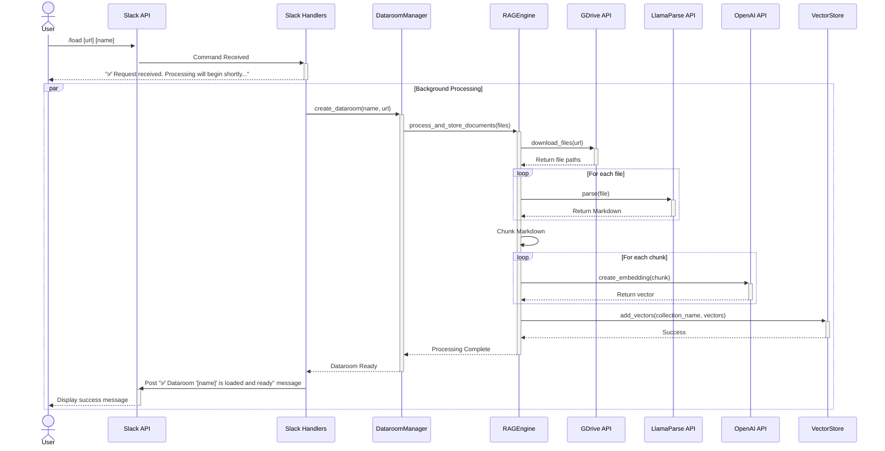
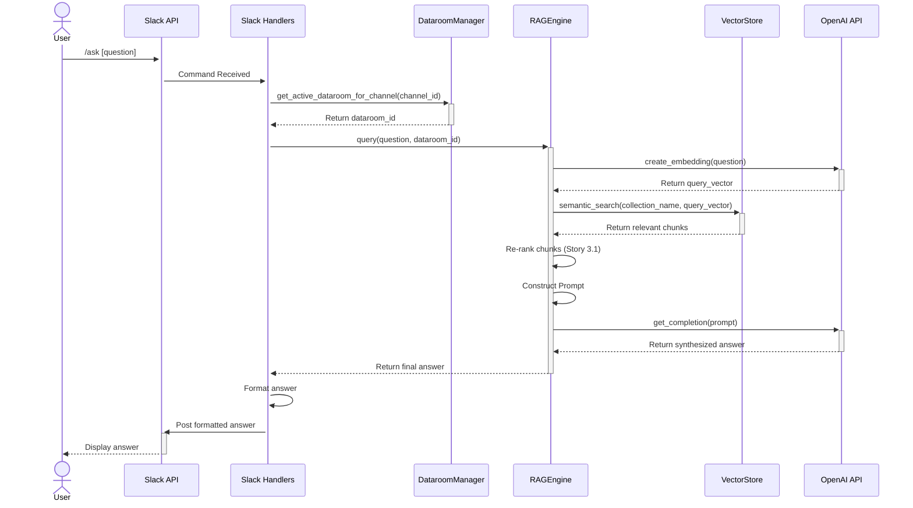

# 7. Core Workflows

## 7.1. Workflow 1: Data Ingestion via `/load` Command

This diagram illustrates the asynchronous process of loading and processing a new dataroom.

## 7.2. Workflow 2: Q&A via `/ask` Command

This diagram illustrates the synchronous process of answering a user's question.

---
