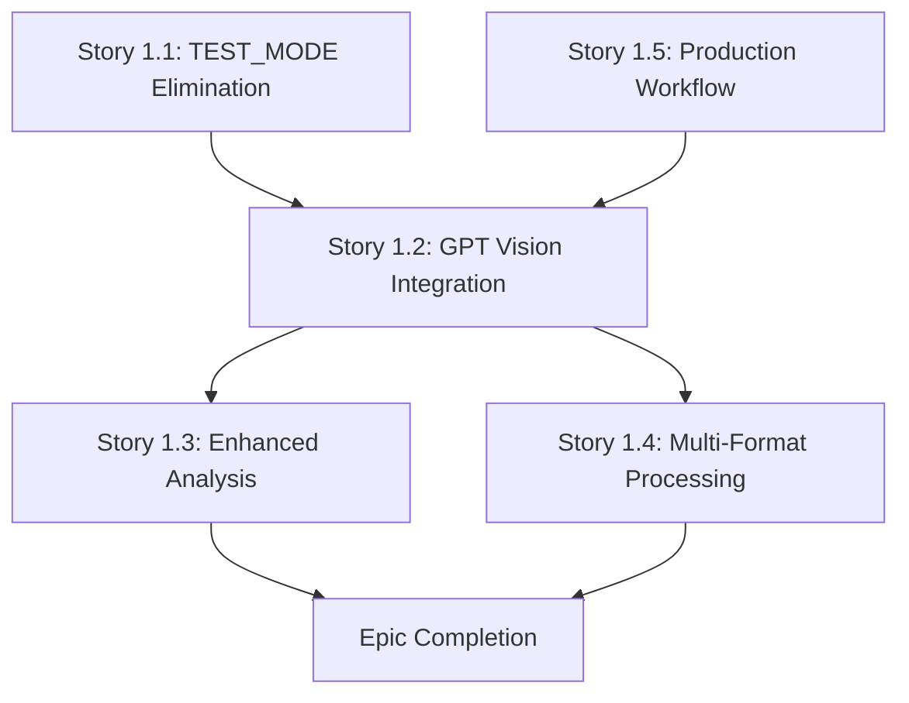

# Technical Implementation Guidance

**Epic**: Intelligent Visual Document Extraction & Complete Architecture Simplification  
**Version**: 1.0  
**Last Updated**: 2025-01-11  

## Implementation Approach

### Development Sequence Strategy

**Phase 1: Foundation Simplification** (Stories 1.1 + 1.5)
- Complete TEST_MODE elimination before vision integration
- Establish production-only development workflow
- Create clean foundation for enhanced functionality

**Phase 2: Vision Infrastructure** (Story 1.2)
- Implement GPT Vision integration with cost controls
- Establish image processing and session data enhancement
- Create foundation for cross-command enhancement

**Phase 3: Command Enhancement** (Stories 1.3 + 1.4)
- Enhance all commands with vision capabilities
- Implement intelligent multi-format processing
- Validate comprehensive functionality improvement

### Implementation Dependencies



## Architecture Overview

### Current System Architecture
```
User Request → Slack Handler → Document Processor → Text Extraction → AI Analysis → Response
                                                ↓
                                            Session Storage
```

### Enhanced System Architecture
```
User Request → Slack Handler → Document Classifier → Processing Engine → AI Analysis → Response
                                        ↓                    ↓
                               Document Analysis    [Vision/Text/Native/Hybrid]
                                        ↓                    ↓
                                Enhanced Session Storage ← Result Synthesis
```

### Key Architectural Changes

#### Document Processing Pipeline Enhancement
- **Input**: Document classification and complexity analysis
- **Processing**: Intelligent strategy selection (vision/text/native/hybrid)
- **Output**: Unified extraction results with quality scoring
- **Integration**: Enhanced session data accessible to all commands

#### Session Data Structure Evolution
```python
# Current Session Structure
user_sessions[user_id] = {
    'analyzed_documents': [...],
    'extracted_text': {...},
    'market_research_data': {...}
}

# Enhanced Session Structure  
user_sessions[user_id] = {
    'documents': {
        'doc_id_1': {
            'format': 'pdf_visual_heavy',
            'processing_strategy': 'vision_enhanced',
            'text_extraction': {...},
            'visual_analysis': {...},
            'confidence_score': 0.85,
            'processing_cost': 0.45
        }
    },
    'synthesized_insights': {...},
    'cross_document_analysis': {...},
    'market_research_data': {...}
}
```

## Technology Stack Integration

### Current Dependencies (Maintained)
```python
# Core Framework
Flask==2.3.3
slack-bolt==1.18.0

# Document Processing  
PyPDF2==3.0.1
pdfplumber==0.9.0
pandas==2.0.3
openpyxl==3.1.2

# AI Integration
openai==0.28.1
requests==2.31.0
```

### New Dependencies (Added)
```python
# Image Processing for GPT Vision
Pillow==10.0.0
pdf2image==1.16.3

# Enhanced Data Processing
numpy==1.24.3

# Cost Monitoring
python-dotenv==1.0.0  # Enhanced usage
```

### OpenAI Integration Enhancement

#### Current Integration
```python
# Simple GPT-4 text analysis
response = openai.ChatCompletion.create(
    model="gpt-4",
    messages=[{"role": "user", "content": text_prompt}]
)
```

#### Enhanced Integration  
```python
# GPT Vision + Text integration
def analyze_document_comprehensive(text_content, image_data=None):
    if image_data and should_use_vision(text_content):
        # Vision analysis
        vision_response = openai.ChatCompletion.create(
            model="gpt-4-vision-preview",
            messages=[{
                "role": "user", 
                "content": [
                    {"type": "text", "text": vision_prompt},
                    {"type": "image_url", "image_url": {"url": image_data}}
                ]
            }]
        )
        
        # Synthesis analysis
        synthesis_response = openai.ChatCompletion.create(
            model="gpt-4",
            messages=[{
                "role": "user",
                "content": create_synthesis_prompt(text_content, vision_response)
            }]
        )
        
        return synthesize_results(vision_response, synthesis_response)
    else:
        # Fallback to text-only analysis
        return analyze_text_only(text_content)
```

## File Structure Organization

### Current Structure (Maintained)
```
dataroom-intelligence/
├── app.py                    # Main Flask application
├── handlers/                 # Command handlers
│   ├── ai_analyzer.py       # AI analysis logic
│   ├── doc_processor.py     # Document processing
│   └── market_research_handler.py
├── agents/                   # Analysis agents
├── utils/                    # Utility functions
└── config/                   # Configuration
```

### Enhanced Structure (New Components)
```
dataroom-intelligence/
├── app.py                    # Simplified startup (no TEST_MODE)
├── handlers/                 # Enhanced handlers
│   ├── ai_analyzer.py       # Multi-source analysis
│   ├── doc_processor.py     # Enhanced with vision
│   └── market_research_handler.py
├── agents/                   # Simplified agents (no TEST_MODE)
├── utils/                    # Enhanced utilities
│   ├── vision_processor.py  # NEW: GPT Vision integration
│   ├── document_classifier.py # NEW: Document analysis
│   ├── processing_engine.py # NEW: Strategy execution
│   ├── cost_monitor.py      # NEW: Cost tracking
│   └── enhanced_session.py  # NEW: Session management
├── config/                   # Simplified configuration
└── docs/epic-vision-integration/ # NEW: Epic documentation
```

## Implementation Guidelines

### Code Quality Standards

#### Error Handling Strategy
```python
# Robust error handling with fallbacks
def process_document_with_vision(document_path):
    try:
        # Attempt vision processing
        result = vision_processor.analyze(document_path)
        return {'status': 'success', 'data': result, 'method': 'vision'}
    except VisionAPIException as e:
        logger.warning(f"Vision processing failed: {e}")
        # Graceful fallback to text extraction
        result = text_processor.extract(document_path)
        return {'status': 'fallback', 'data': result, 'method': 'text'}
    except Exception as e:
        logger.error(f"Document processing failed: {e}")
        return {'status': 'error', 'error': str(e)}
```

#### Cost Control Implementation
```python
class CostAwareProcessor:
    def __init__(self, daily_budget=10.00):
        self.daily_budget = daily_budget
        self.current_usage = 0.0
        
    def can_process_with_vision(self, estimated_cost):
        return (self.current_usage + estimated_cost) <= self.daily_budget
        
    def process_with_cost_control(self, document, strategy):
        if strategy == 'vision_enhanced':
            estimated_cost = self.estimate_vision_cost(document)
            if not self.can_process_with_vision(estimated_cost):
                logger.info("Budget limit reached, falling back to text extraction")
                strategy = 'text_only'
                
        return self.execute_strategy(document, strategy)
```

### Testing Strategy Implementation

#### Unit Testing Approach
```python
# Test vision processing with mocked API responses
def test_vision_processor():
    with patch('openai.ChatCompletion.create') as mock_openai:
        mock_openai.return_value = mock_vision_response
        
        processor = VisionProcessor()
        result = processor.analyze_pdf_page(test_image_data)
        
        assert result['status'] == 'success'
        assert 'visual_elements' in result['data']
        mock_openai.assert_called_once()
```

#### Integration Testing Approach  
```python
# Test end-to-end command enhancement
def test_gaps_command_with_vision():
    # Setup session with vision-enhanced document
    session_data = create_test_session_with_vision_data()
    
    # Execute gaps command
    response = gaps_handler.handle_gaps_command(test_user_id)
    
    # Verify response includes vision insights
    assert 'visual analysis' in response.lower()
    assert response_quality_score(response) > baseline_score
```

### Performance Optimization

#### Memory Management
```python
class EfficientImageProcessor:
    def __init__(self):
        self.max_image_size = (1024, 1024)  # Optimize for API efficiency
        
    def process_pdf_page(self, pdf_page):
        # Convert to image with optimization
        image = pdf_page.to_image(resolution=150)  # Balance quality vs size
        
        # Resize if necessary
        if image.size[0] > self.max_image_size[0]:
            image = image.resize(self.max_image_size, Image.LANCZOS)
            
        # Convert to base64 for API
        image_data = self.image_to_base64(image)
        
        # Cleanup
        del image
        
        return image_data
```

#### Session Data Optimization
```python
class OptimizedSessionManager:
    def store_analysis_results(self, user_id, document_id, results):
        # Store only essential data, not raw images
        optimized_results = {
            'summary': results['summary'],
            'key_insights': results['key_insights'],
            'confidence_score': results['confidence_score'],
            'processing_metadata': results['metadata']
            # Exclude: raw_image_data, full_response_text
        }
        
        self.user_sessions[user_id]['documents'][document_id] = optimized_results
```

## Development Workflow Guidelines

### Production-Only Development Process

#### Setup Process
1. **Environment Configuration**: Only essential API keys required
2. **Cost Monitoring Setup**: Configure daily development budget
3. **API Key Validation**: Verify all production API access
4. **Development Budget**: Establish cost tracking and alerts

#### Development Practices
```bash
# Simplified development startup
export OPENAI_API_KEY="sk-..."
export TAVILY_API_KEY="tvly-..."
export SLACK_BOT_TOKEN="xoxb-..."
export DAILY_DEV_BUDGET="10.00"

python app.py  # No mode configuration needed
```

#### Cost Management During Development
```python
# Development cost tracking
@cost_monitor.track_api_usage
def development_api_call(api_function, *args, **kwargs):
    """Wrapper for API calls with cost tracking"""
    start_time = time.time()
    
    try:
        result = api_function(*args, **kwargs)
        cost = estimate_api_cost(api_function, result)
        cost_monitor.record_usage(cost)
        return result
    except BudgetExceededException:
        logger.warning("Daily development budget exceeded")
        raise
```

### Quality Assurance Process

#### Code Review Checklist
- [ ] **TEST_MODE Elimination**: No conditional mode logic remains
- [ ] **Error Handling**: Proper fallback mechanisms implemented
- [ ] **Cost Controls**: Budget management and monitoring active
- [ ] **Session Compatibility**: Enhanced data structure maintains backward compatibility
- [ ] **Performance**: Memory usage and processing time within targets
- [ ] **Documentation**: Implementation matches specification requirements

#### Integration Validation
- [ ] **Cross-Command Functionality**: All commands access enhanced data correctly
- [ ] **Backward Compatibility**: Existing functionality preserved
- [ ] **Error Scenarios**: Graceful degradation tested and verified
- [ ] **Cost Efficiency**: Processing decisions optimize quality vs cost
- [ ] **Performance Targets**: Response times meet specified requirements

## Risk Mitigation Implementation

### API Reliability
```python
class ResilientAPIClient:
    def __init__(self, max_retries=3, backoff_factor=2):
        self.max_retries = max_retries
        self.backoff_factor = backoff_factor
        
    def call_with_retry(self, api_function, *args, **kwargs):
        for attempt in range(self.max_retries):
            try:
                return api_function(*args, **kwargs)
            except (APITimeout, RateLimitError) as e:
                if attempt < self.max_retries - 1:
                    wait_time = self.backoff_factor ** attempt
                    time.sleep(wait_time)
                    continue
                else:
                    raise e
```

### Cost Overrun Prevention
```python
class BudgetGuard:
    def __init__(self):
        self.daily_limit = float(os.getenv('DAILY_DEV_BUDGET', '10.00'))
        self.warning_threshold = 0.8
        
    def check_budget_before_processing(self, estimated_cost):
        current_usage = self.get_daily_usage()
        
        if current_usage + estimated_cost > self.daily_limit:
            raise BudgetExceededException("Daily budget limit would be exceeded")
            
        if current_usage + estimated_cost > (self.daily_limit * self.warning_threshold):
            logger.warning(f"Approaching daily budget limit: {current_usage + estimated_cost:.2f}/{self.daily_limit:.2f}")
```

---

*This technical guidance provides comprehensive implementation direction for all epic stories, ensuring consistent architecture, quality standards, and risk mitigation across the entire enhancement project.*