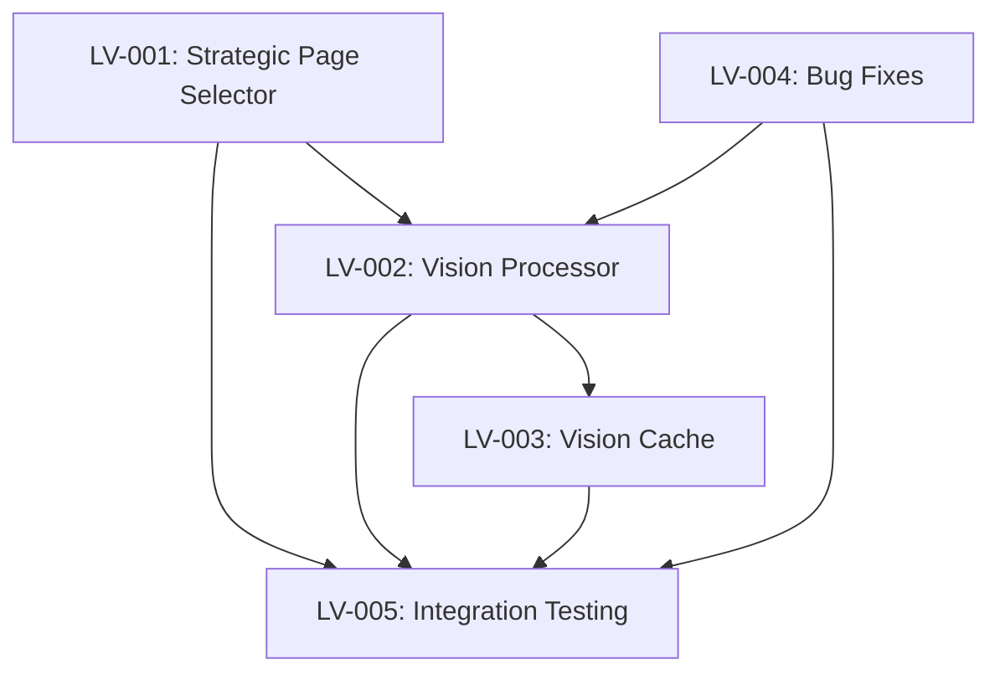
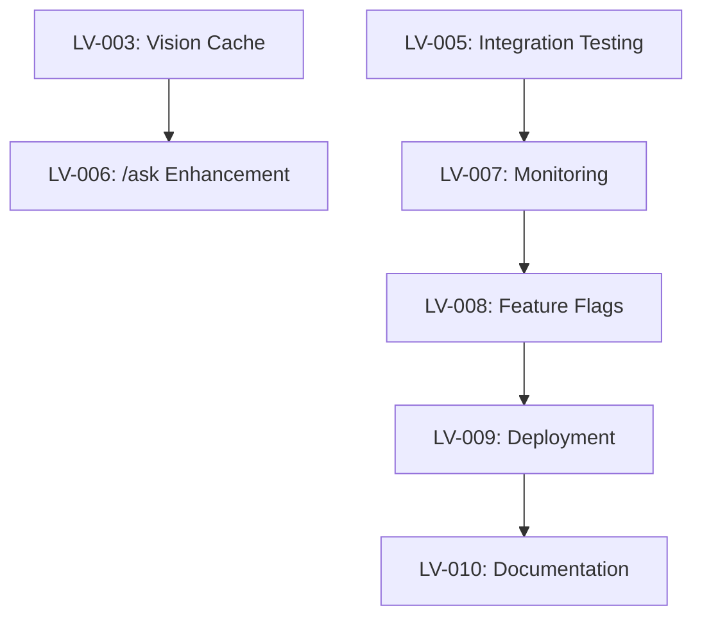

# Lazy Vision User Stories - Implementation Ready

**Source Documents**: 
- `docs/lazy-vision-brownfield-prd.md`
- `docs/lazy-vision-implementation-tasks.md`
- `docs/architecture/lazy-vision-brownfield-architecture.md`

**Epic**: Lazy Vision Document Analysis Enhancement  
**Sprint Planning**: Ready for development team assignment  
**Story Point Estimation**: Included for sprint planning  

---

## EPIC OVERVIEW

**Epic Goal**: Implement strategic vision processing to extract high-quality data from pitch deck visuals while preventing SSL exhaustion failures.

**Epic Value**: Restore system from 0% to 95% success rate while improving data accuracy from 60% to 95% on financial metrics.

**Epic Success Criteria**:
- 95% analysis success rate
- <30 second response time  
- 95% accuracy on financial/competition/market data
- 84% cost reduction vs current approach

---

## SPRINT 1: CORE INFRASTRUCTURE (Stories LV-001 to LV-005)

### Story LV-001: Strategic Page Selector - Content Analysis Engine

**As a** DataRoom Intelligence system  
**I want** to intelligently identify 5-7 most valuable pages containing business-critical visual data  
**So that** I can process only strategic content and prevent SSL exhaustion while capturing key insights

#### **Acceptance Criteria**

**AC1: Content Pattern Detection**
- [ ] GIVEN a PDF with 15+ pages
- [ ] WHEN the system analyzes content using keyword patterns
- [ ] THEN it identifies pages containing financial, competition, market, traction, or team content
- [ ] AND scores each page based on keyword density and business value

**AC2: Priority-Based Selection**
- [ ] GIVEN multiple pages match different categories
- [ ] WHEN the system selects pages for processing
- [ ] THEN it prioritizes: Financials (P1) > Competition (P1) > Market (P2) > Traction (P2) > Team (P3)
- [ ] AND never exceeds 7 pages total (hard limit)

**AC3: Fallback Pattern Matching**
- [ ] GIVEN a deck where content analysis finds <3 strategic pages
- [ ] WHEN the content-based detection fails
- [ ] THEN the system uses common deck structure patterns (pages 4, 8, 12, 16, 18-20)
- [ ] AND ensures minimum 3 pages selected for processing

**AC4: Selection Rationale Logging**
- [ ] GIVEN any page selection process
- [ ] WHEN pages are selected
- [ ] THEN the system logs: selected pages, categories, keyword matches, confidence scores
- [ ] AND provides debugging information for optimization

#### **Technical Requirements**
```python
# File: utils/strategic_page_selector.py
class StrategicPageSelector:
    KEY_PATTERNS = {
        'financials': ['revenue', 'ARR', 'burn rate', 'runway', 'cash flow', 'unit economics'],
        'competition': ['competitor', 'competitive', 'vs', 'landscape', 'positioning'],
        'market': ['TAM', 'SAM', 'SOM', 'market size', 'opportunity', 'addressable'],
        'traction': ['growth', 'users', 'customers', 'retention', 'churn', 'metrics'],
        'team': ['founder', 'CEO', 'CTO', 'leadership', 'team', 'advisory']
    }
    
    def select_strategic_pages(self, pdf_path: str, max_pages: int = 7) -> Dict[str, List[int]]
```

#### **Definition of Done**
- [ ] Class implemented with all methods
- [ ] Unit tests pass for 5+ different deck formats
- [ ] Performance test: selection completes in <2 seconds
- [ ] Integration test: returns valid page numbers within PDF bounds
- [ ] Code review approved
- [ ] Documentation updated

**Story Points**: 8  
**Priority**: Must Have  
**Dependencies**: None

---

### Story LV-002: Vision Processor - SSL Safe Implementation

**As a** VC analyst  
**I want** vision processing to complete successfully without SSL timeouts  
**So that** I get accurate data from charts, graphs, and visual elements in pitch decks

#### **Acceptance Criteria**

**AC1: Hard Page Limit Enforcement**
- [ ] GIVEN any number of selected pages
- [ ] WHEN vision processing begins
- [ ] THEN the system processes maximum 7 pages only
- [ ] AND rejects additional pages with warning log

**AC2: Per-Page Timeout Protection**
- [ ] GIVEN each page being processed
- [ ] WHEN processing exceeds 5 seconds
- [ ] THEN the system times out gracefully and moves to next page
- [ ] AND logs timeout for monitoring

**AC3: SSL-Safe Client Configuration**
- [ ] GIVEN OpenAI API calls
- [ ] WHEN making vision requests
- [ ] THEN the system uses single connection pool (max_connections=1)
- [ ] AND modern gpt-4o model (not deprecated gpt-4-vision-preview)

**AC4: Graceful Error Handling**
- [ ] GIVEN any vision processing failure
- [ ] WHEN SSL or timeout errors occur
- [ ] THEN the system logs error details and continues with remaining pages
- [ ] AND provides partial results rather than complete failure

**AC5: Quality Content Extraction**
- [ ] GIVEN a financial chart page
- [ ] WHEN processed with vision
- [ ] THEN the system extracts specific numbers, percentages, and trends
- [ ] AND achieves >90% accuracy vs manual review

#### **Technical Requirements**
```python
# File: handlers/vision_processor.py (enhanced)
class VisionProcessor:
    def __init__(self):
        self.max_pages = 7
        self.timeout_per_page = 5
        self.model = "gpt-4o"
        self.client = self._configure_ssl_safe_client()
    
    def process_pdf_with_vision(self, pdf_path: str, pages: List[int] = None) -> Dict
```

#### **Definition of Done**
- [ ] SSL-safe client configuration implemented
- [ ] Hard limits enforced (7 pages, 5s timeout)
- [ ] Error handling with graceful degradation
- [ ] Integration test: processes 43-page deck without SSL errors
- [ ] Performance test: completes 7 pages in <35 seconds
- [ ] Code review approved

**Story Points**: 13  
**Priority**: Must Have  
**Dependencies**: LV-001 (page selection)

---

### Story LV-003: Vision Cache Infrastructure

**As a** VC analyst  
**I want** vision results cached in my session  
**So that** follow-up questions are answered instantly without re-processing

#### **Acceptance Criteria**

**AC1: Enhanced Session Structure**
- [ ] GIVEN a user session
- [ ] WHEN vision processing completes
- [ ] THEN results are stored in user_sessions[user_id]['vision_cache']
- [ ] AND includes: pages_processed, strategic_selection, data, search_index

**AC2: Searchable Index Creation**
- [ ] GIVEN vision processing results
- [ ] WHEN caching data
- [ ] THEN the system creates searchable index by category and keywords
- [ ] AND enables fast query matching for /ask commands

**AC3: Cache Performance**
- [ ] GIVEN cached vision data
- [ ] WHEN /ask command queries cache
- [ ] THEN response is provided in <3 seconds for cache hits
- [ ] AND cache hit rate is >75% for common questions

**AC4: Memory Management**
- [ ] GIVEN vision cache data
- [ ] WHEN cache size exceeds 50KB per user
- [ ] THEN the system compacts data (keep summaries, remove full content)
- [ ] AND automatically expires cache after 24 hours

#### **Technical Requirements**
```python
# Enhanced session structure
user_sessions[user_id]['vision_cache'] = {
    'pages_processed': [18, 19, 11, 12, 8],
    'strategic_selection': {
        'financials': [18, 19],
        'competition': [11, 12],
        'market': [8]
    },
    'data': {
        18: {
            'category': 'financials',
            'content': 'Revenue growth chart shows...',
            'confidence': 0.92,
            'key_phrases': ['revenue', '$2M ARR', '15% growth']
        }
    },
    'search_index': {
        'financials': ['revenue', 'ARR', 'growth'],
        'competition': ['vs', 'landscape']
    },
    'cached_at': '2025-09-15T10:30:00Z'
}
```

#### **Definition of Done**
- [ ] Session structure enhanced with vision_cache
- [ ] Cache population during /analyze command
- [ ] Search index generation for fast queries
- [ ] Memory management with TTL and size limits
- [ ] Unit tests for cache operations
- [ ] Performance test: cache hit <3s, cache miss <7s

**Story Points**: 5  
**Priority**: Must Have  
**Dependencies**: LV-002 (vision processing)

---

### Story LV-004: Critical Bug Fixes - PDF Path & Integration

**As a** system administrator  
**I want** PDF files properly accessible to vision processing  
**So that** the enhancement can read document content

#### **Acceptance Criteria**

**AC1: PDF Path Propagation Fix**
- [ ] GIVEN /analyze command with Google Drive link
- [ ] WHEN documents are extracted and processed
- [ ] THEN actual PDF file path is passed to vision processor (not None)
- [ ] AND vision processor can successfully access the file

**AC2: Session Manager Integration**
- [ ] GIVEN vision processing results
- [ ] WHEN EnhancedSessionManager processes documents
- [ ] THEN it handles both text and vision data correctly
- [ ] AND maintains data structure consistency

**AC3: Document Processor Compatibility**
- [ ] GIVEN existing document processing pipeline
- [ ] WHEN vision enhancement is integrated
- [ ] THEN all existing functionality continues to work
- [ ] AND no regression in text extraction capabilities

#### **Technical Requirements**
```python
# Fix in app.py
@app.command("/analyze")
def handle_analyze(ack, body, client):
    # Extract documents
    docs = extract_documents_from_drive(drive_link)
    
    # FIX: Pass actual PDF path
    vision_results = vision_processor.process_pdf_with_vision(
        pdf_path=docs[0]['pdf_path'],  # Not None
        pages=None  # Auto-select strategic pages
    )
```

#### **Definition of Done**
- [ ] PDF path bug fixed in app.py
- [ ] Session manager handles vision data
- [ ] No regression in existing document processing
- [ ] Integration test: end-to-end /analyze with vision
- [ ] Code review approved

**Story Points**: 3  
**Priority**: Must Have  
**Dependencies**: None (can run in parallel)

---

### Story LV-005: Integration Testing Suite

**As a** developer  
**I want** comprehensive tests validating vision enhancement  
**So that** I can ensure quality and prevent regressions

#### **Acceptance Criteria**

**AC1: Strategic Page Selection Tests**
- [ ] GIVEN various deck formats (15-page, 30-page, 43-page)
- [ ] WHEN running page selection tests
- [ ] THEN correct strategic pages are identified for each format
- [ ] AND selection completes in <2 seconds

**AC2: SSL Prevention Validation**
- [ ] GIVEN a 43-page pitch deck
- [ ] WHEN vision processing runs
- [ ] THEN zero SSL exhaustion errors occur
- [ ] AND processing completes in <35 seconds

**AC3: Data Quality Testing**
- [ ] GIVEN sample financial chart pages
- [ ] WHEN processed with vision
- [ ] THEN extracted data matches manual review >90% accuracy
- [ ] AND includes specific numbers, percentages, trends

**AC4: End-to-End Workflow Tests**
- [ ] GIVEN complete /analyze command
- [ ] WHEN executed with real pitch deck
- [ ] THEN report is generated with enhanced data quality
- [ ] AND vision cache is populated for /ask optimization

#### **Test Scenarios**
```python
test_scenarios = [
    "standard_20_page_deck.pdf",    # Normal case
    "long_43_page_deck.pdf",        # SSL exhaustion test
    "visual_heavy_deck.pdf",        # Chart extraction test
    "text_only_deck.pdf",           # Minimal vision test
    "financial_focus_deck.pdf"      # Accuracy validation
]
```

#### **Definition of Done**
- [ ] Unit tests for all components (>90% coverage)
- [ ] Integration tests for vision pipeline
- [ ] Performance tests validate timing requirements
- [ ] End-to-end tests with real deck samples
- [ ] All tests pass in CI/CD pipeline

**Story Points**: 5  
**Priority**: Must Have  
**Dependencies**: LV-001, LV-002, LV-003, LV-004

---

## SPRINT 2: OPTIMIZATION & DEPLOYMENT (Stories LV-006 to LV-010)

### Story LV-006: /ask Enhancement - On-Demand Processing

**As a** VC analyst  
**I want** to ask specific questions about deck content and get accurate answers  
**So that** I can explore investment opportunities beyond the initial report

#### **Acceptance Criteria**

**AC1: Question Intent Analysis**
- [ ] GIVEN a question like "What is the revenue growth rate?"
- [ ] WHEN /ask command processes the question
- [ ] THEN it categorizes intent: financials, competition, market, traction, team
- [ ] AND determines if existing cache contains relevant data

**AC2: Cache-First Response**
- [ ] GIVEN a question about cached content
- [ ] WHEN cache contains relevant vision data
- [ ] THEN response is provided in 2-3 seconds
- [ ] AND includes specific details from cached visual analysis

**AC3: On-Demand Processing**
- [ ] GIVEN a question not covered by cache
- [ ] WHEN relevant pages are identified
- [ ] THEN system processes maximum 3 additional pages
- [ ] AND updates cache with new results for future queries

**AC4: Response Quality**
- [ ] GIVEN any /ask question
- [ ] WHEN answering from vision or text data
- [ ] THEN response includes specific numbers, percentages, insights
- [ ] AND cites source (page numbers, visual elements)

#### **Technical Requirements**
```python
def enhanced_ask_command(question: str, user_id: str) -> Dict:
    # 1. Analyze question intent
    intent = analyze_question_intent(question)
    
    # 2. Check cache first (80% hit rate expected)
    cache_result = check_vision_cache_for_answer(user_id, intent)
    if cache_result['cache_hit']:
        return generate_answer_from_cache(question, cache_result)
    
    # 3. On-demand processing (max 3 pages)
    relevant_pages = find_relevant_pages(question, exclude_cached=True)[:3]
    if relevant_pages:
        on_demand_results = process_on_demand_vision(relevant_pages)
        update_vision_cache(user_id, on_demand_results)
        return generate_answer_with_new_data(question, on_demand_results)
    
    # 4. Text-only fallback
    return generate_text_only_answer(question)
```

#### **Definition of Done**
- [ ] Question intent analysis implemented
- [ ] Cache-first response logic
- [ ] On-demand processing (max 3 pages)
- [ ] Cache update with new results
- [ ] Integration test: 80% cache hit rate
- [ ] Performance test: <3s cached, <7s on-demand

**Story Points**: 8  
**Priority**: Should Have  
**Dependencies**: LV-003 (vision cache)

---

### Story LV-007: Performance Monitoring & Metrics

**As a** product manager  
**I want** to track success metrics in real-time  
**So that** I can validate the enhancement meets business objectives

#### **Acceptance Criteria**

**AC1: Technical Metrics Tracking**
- [ ] GIVEN vision processing operations
- [ ] WHEN system processes documents
- [ ] THEN it tracks: success rate, response time, pages processed, SSL errors
- [ ] AND logs metrics for dashboard consumption

**AC2: Business Metrics Tracking**
- [ ] GIVEN completed analyses
- [ ] WHEN vision enhancement is used
- [ ] THEN it tracks: data accuracy improvements, cost per analysis, user satisfaction
- [ ] AND compares against baseline (text-only) metrics

**AC3: Real-Time Alerting**
- [ ] GIVEN system performance
- [ ] WHEN success rate drops below 90% OR SSL errors occur
- [ ] THEN alert is triggered to engineering team
- [ ] AND includes diagnostic information for quick resolution

**AC4: Dashboard Visualization**
- [ ] GIVEN collected metrics
- [ ] WHEN viewed in dashboard
- [ ] THEN shows: success rate trend, response time P95, cost reduction %, accuracy %
- [ ] AND enables drill-down by time period and user

#### **Metrics to Track**
```python
METRICS = {
    # Technical Metrics
    'vision_success_rate': Counter('vision_success_total'),
    'vision_response_time': Histogram('vision_response_seconds'),
    'vision_pages_processed': Histogram('vision_pages_count'),
    'ssl_errors': Counter('ssl_error_total'),
    'cache_hit_rate': Gauge('cache_hit_percentage'),
    
    # Business Metrics  
    'cost_per_analysis': Gauge('analysis_cost_dollars'),
    'data_accuracy_financial': Gauge('financial_accuracy_percentage'),
    'data_accuracy_competition': Gauge('competition_accuracy_percentage'),
    'user_satisfaction': Gauge('user_satisfaction_score')
}
```

#### **Definition of Done**
- [ ] Metrics collection implemented
- [ ] Real-time alerting configured
- [ ] Dashboard created with key metrics
- [ ] Baseline comparison available
- [ ] Alert testing completed

**Story Points**: 5  
**Priority**: Should Have  
**Dependencies**: All Phase 1 stories

---

### Story LV-008: Feature Flag & Rollout Infrastructure

**As a** product manager  
**I want** to safely deploy vision enhancement with instant rollback capability  
**So that** I can minimize risk during production deployment

#### **Acceptance Criteria**

**AC1: Feature Flag Implementation**
- [ ] GIVEN environment configuration
- [ ] WHEN LAZY_VISION_ENABLED=false
- [ ] THEN system operates with text-only processing (fallback mode)
- [ ] AND no vision API calls are made

**AC2: Progressive Rollout Control**
- [ ] GIVEN LAZY_VISION_ROLLOUT_PERCENTAGE setting
- [ ] WHEN set to 10%, 50%, or 100%
- [ ] THEN only that percentage of users get vision enhancement
- [ ] AND others continue with existing text-only processing

**AC3: Instant Rollback Capability**
- [ ] GIVEN any production issues
- [ ] WHEN LAZY_VISION_ENABLED is set to false
- [ ] THEN all users immediately revert to text-only processing
- [ ] AND no service disruption occurs

**AC4: Configuration Monitoring**
- [ ] GIVEN feature flag changes
- [ ] WHEN configuration is updated
- [ ] THEN change is logged with timestamp and user
- [ ] AND rollout percentage is visible in monitoring dashboard

#### **Configuration Options**
```bash
# Feature control
LAZY_VISION_ENABLED=true/false

# Processing limits
VISION_MAX_PAGES=7
VISION_TIMEOUT_PER_PAGE=5

# Rollout control
LAZY_VISION_ROLLOUT_PERCENTAGE=10,50,100

# Safety limits
VISION_DAILY_BUDGET_LIMIT=50.00
```

#### **Definition of Done**
- [ ] Feature flag implementation
- [ ] Progressive rollout logic
- [ ] Instant rollback testing
- [ ] Configuration change logging
- [ ] Rollout dashboard created

**Story Points**: 3  
**Priority**: Must Have  
**Dependencies**: LV-007 (monitoring)

---

### Story LV-009: Production Deployment & Validation

**As a** system administrator  
**I want** to deploy vision enhancement to production safely  
**So that** users get improved data quality without service disruption

#### **Acceptance Criteria**

**AC1: Staging Deployment**
- [ ] GIVEN staging environment
- [ ] WHEN vision enhancement is deployed
- [ ] THEN all functionality works with real pitch deck samples
- [ ] AND performance meets targets (<30s response, 95% success)

**AC2: Progressive Production Rollout**
- [ ] GIVEN production environment
- [ ] WHEN rolling out in phases (10% → 50% → 100%)
- [ ] THEN each phase runs for 24 hours with monitoring
- [ ] AND no critical issues occur before next phase

**AC3: Success Metrics Validation**
- [ ] GIVEN production usage data
- [ ] WHEN enhancement has been running for 1 week
- [ ] THEN success rate is >95%, response time <30s, cost reduction >80%
- [ ] AND user feedback is positive (>4.0/5 satisfaction)

**AC4: Rollback Testing**
- [ ] GIVEN production deployment
- [ ] WHEN rollback is triggered during deployment
- [ ] THEN system reverts to text-only processing within 30 seconds
- [ ] AND no data loss or service disruption occurs

#### **Deployment Checklist**
```yaml
Pre-Deployment:
- [ ] All unit tests passing
- [ ] Integration tests passing
- [ ] Performance tests meet targets
- [ ] Security review completed
- [ ] Rollback plan documented

Deployment:
- [ ] Deploy to staging, validate
- [ ] Deploy to production 10%
- [ ] Monitor for 24 hours
- [ ] Deploy to production 50%
- [ ] Monitor for 24 hours
- [ ] Deploy to production 100%

Post-Deployment:
- [ ] Success metrics validation
- [ ] User feedback collection
- [ ] Performance monitoring
- [ ] Cost analysis confirmation
```

#### **Definition of Done**
- [ ] Successful staging deployment
- [ ] Progressive production rollout completed
- [ ] Success metrics validated
- [ ] User feedback collected
- [ ] Rollback capability verified

**Story Points**: 8  
**Priority**: Must Have  
**Dependencies**: LV-008 (feature flags)

---

### Story LV-010: Documentation & Training Materials

**As a** stakeholder  
**I want** comprehensive documentation and training  
**So that** I can understand and support the new vision capabilities

#### **Acceptance Criteria**

**AC1: User Documentation**
- [ ] GIVEN enhanced system capabilities
- [ ] WHEN users access documentation
- [ ] THEN they understand: what vision enhancement provides, how data quality improved, what new insights are available
- [ ] AND include before/after examples of report quality

**AC2: Technical Documentation**
- [ ] GIVEN system architecture changes
- [ ] WHEN developers access technical docs
- [ ] THEN they understand: component interactions, data flow, monitoring, troubleshooting
- [ ] AND include code examples and API changes

**AC3: Training Materials**
- [ ] GIVEN customer success team needs
- [ ] WHEN training on new capabilities
- [ ] THEN materials explain: key value propositions, common user questions, troubleshooting guide
- [ ] AND include demo scripts with sample results

**AC4: Monitoring & Maintenance Guide**
- [ ] GIVEN operational requirements
- [ ] WHEN system issues occur
- [ ] THEN guide provides: common problems, diagnostic steps, escalation procedures
- [ ] AND includes performance baseline reference

#### **Documentation Deliverables**
```
User Documentation:
- "Enhanced Analysis with Vision Processing" (user guide)
- "Understanding Your Enhanced Reports" (before/after examples)

Technical Documentation:  
- "Lazy Vision Architecture Overview" (system design)
- "Vision Processing Component Guide" (implementation details)
- "API Changes and Integration Points" (developer reference)

Training Materials:
- "Vision Enhancement Value Proposition" (sales enablement)
- "Customer Support Guide for Vision Features" (support training)
- "Demo Script: Vision-Enhanced Analysis" (customer demos)

Operations:
- "Lazy Vision Monitoring and Troubleshooting" (ops guide)
- "Performance Baselines and SLA Reference" (operational standards)
```

#### **Definition of Done**
- [ ] All documentation deliverables created
- [ ] Technical review completed
- [ ] Training materials tested with team
- [ ] Documentation published and accessible
- [ ] Feedback incorporated from initial users

**Story Points**: 3  
**Priority**: Should Have  
**Dependencies**: LV-009 (successful deployment)

---

## STORY DEPENDENCIES & SPRINT PLANNING

### Sprint 1 Dependencies


### Sprint 2 Dependencies


## STORY POINT SUMMARY

### Sprint 1 (Stories LV-001 to LV-005)
- **LV-001**: 8 points (Strategic Page Selector)
- **LV-002**: 13 points (Vision Processor) 
- **LV-003**: 5 points (Vision Cache)
- **LV-004**: 3 points (Bug Fixes)
- **LV-005**: 5 points (Integration Testing)
- **Sprint 1 Total**: 34 points

### Sprint 2 (Stories LV-006 to LV-010)
- **LV-006**: 8 points (/ask Enhancement)
- **LV-007**: 5 points (Monitoring)
- **LV-008**: 3 points (Feature Flags)
- **LV-009**: 8 points (Deployment)
- **LV-010**: 3 points (Documentation)
- **Sprint 2 Total**: 27 points

**Epic Total**: 61 story points

---

## RISK MITIGATION BY STORY

### High-Risk Stories
- **LV-002** (Vision Processor): SSL prevention critical
- **LV-009** (Production Deployment): User impact risk

### Medium-Risk Stories  
- **LV-001** (Page Selector): Content detection accuracy
- **LV-006** (/ask Enhancement): Query intelligence complexity

### Low-Risk Stories
- **LV-003, LV-004, LV-005, LV-007, LV-008, LV-010**: Infrastructure and support

---

*User stories prepared by John (Product Manager) for immediate sprint planning and development team assignment. Stories are implementation-ready with detailed acceptance criteria and technical requirements.*